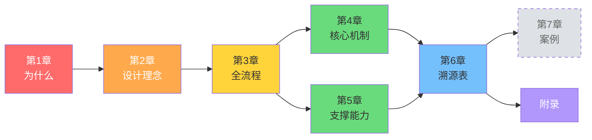

# AI 原生研发闭环体系 · 设计小册

> **一句话目标**：通过 Rules + Hooks + Memory + MCP + 阶段化工作流，把 AI 从"代码补全工具"提升为"可治理的研发执行体"——每个阶段有固定输入、明确约束和标准交付物，过程可追溯、结果可验证、经验可沉淀。

---

## 关于本小册

这不是一份"使用手册"，而是一本**设计决策手册**。

对于体系中的每一个设计点，我们都会回答三个问题：

1. **来自哪里？** — 参考了哪个团队的实践、哪个开源框架的机制
2. **为什么这样设计？** — 解决的是什么真实问题
3. **好处是什么？** — 对我们的项目带来了什么具体收益

当你需要调整架构、增删规则或优化流程时，翻到对应章节，就能找到当初的设计依据，避免"改了但不知道为什么当初这么写"。

---

## 目录

| 章节 | 标题 | 核心问题 |
|------|------|---------|
| [第 1 章](ch01-why.md) | 为什么需要这套体系 | AI 辅助开发的三个核心痛点是什么？ |
| [第 2 章](ch02-design-philosophy.md) | 设计理念与参考来源 | 方案参考了谁？吸收了什么？筛掉了什么？ |
| [第 3 章](ch03-workflow.md) | 全流程设计 | 6 个阶段各做什么？人和 AI 怎么分工？ |
| [第 4 章](ch04-core-mechanisms.md) | 三大核心机制 | 契约先行、验证回流、知识飞轮是怎么运作的？ |
| [第 5 章](ch05-infrastructure.md) | 体系支撑能力 | Rules / Skills / Hooks / Memory / MCP 各承担什么角色？ |
| [第 6 章](ch06-provenance.md) | 产物溯源全表 | 每个具体产物的设计来源是什么？ |
| [第 7 章](ch07-case-study.md) | 落地案例 | *(占位：等真实需求跑完全流程后填充)* |
| [附录](appendix.md) | 附录 | 外部实践对照精要 · 参考来源索引 · 术语表 |

---

## 阅读建议

```
如果你想快速理解全貌      → 先读第 1 章 + 第 3 章
如果你想了解设计依据      → 重点读第 2 章 + 第 6 章
如果你想调整某个具体机制  → 先查第 6 章溯源表，再读对应章节
如果你想新增或修改 Skill  → 第 5 章 + 第 3 章对应阶段
```

---

## 章节依赖关系



---

## 版本信息

| 项目 | 信息 |
|------|------|
| 方案版本 | v0.2 |
| 小册版本 | v1.0-draft |
| 创建日期 | 2026-04-09 |
| 适用范围 | 微信支付存款组 MIS 系统（4 个项目） |
| 方案详尽版 | [ai-native-engineering-scheme.md](../plans/ai-native-engineering-scheme.md) |
| 设计溯源表 | [design-provenance.md](../docs/design-provenance.md) |

---

> **注**：本小册内容基于方案 v0.2 整理。方案调研与执行指令已就绪（5 Rules + 10 Skills + 2 Commands + 3 Hooks），下一步是拿真实需求验证 6 阶段全流程。
