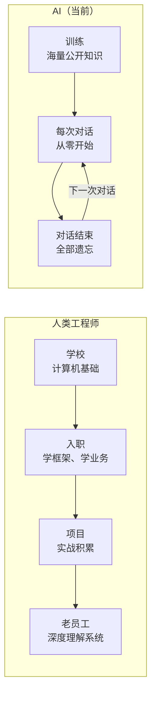
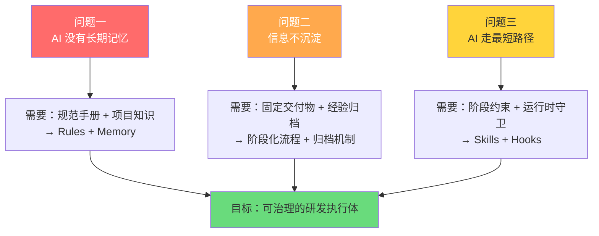

# 第 1 章：为什么需要这套体系

> **本章核心问题**：AI 辅助开发已经在用了，为什么还需要额外搭一套体系？
>
> **读完本章你会知道**：当前 AI 编码工具在实际业务项目中遇到的三个核心问题，以及这些问题如何推导出"需要一套约束体系"的结论。

---

## 1.1 项目背景

我们的工作区包含 **4 个项目**，属于微信支付存款组的内部运营管理系统（MIS）：

| 项目 | 角色 | 技术栈 |
|------|------|--------|
| `mmpayproductpermissionhtml` | **新前端（目标架构）** | Vue 3 + Vite + TDesign + XPage |
| `mmpayxdcproductpermissionweb` | **新后端（目标架构）** | Node.js + XDC Node SDK + OpenAPI |
| `payclient-oa-depositmisview` | 旧前端（迁移参考） | Vue 2 + Element UI + Webpack |
| `lqp` | 旧后端（迁移参考） | Egg.js / Koa / Kite |

新需求开发在新模板上进行，旧项目只用于理解历史逻辑。这是一个**从零搭建**的阶段——新架构刚起步，正是建立规范和流程的最佳时机。

---

## 1.2 AI 的本质：每天都失忆的天才

在展开三个核心问题之前，先理解一个前提——**AI 的本质是什么**。

回想一下人类工程师的成长路径：在学校学了计算机基础，入职后学习内部框架、业务背景、团队规范，然后一个个项目磨练，最终成为独当一面的老员工。

AI 不同。它学过几乎所有公开的技术知识，算法、设计模式、各种开源框架信手拈来。但它有一个致命缺陷：**没有长期记忆**。每次对话开始时，前面所有的积累都归零了。

**一句话总结**：
- 人类工程师 = 普通学生 + 长期记忆 + 多年积累 → 老员工
- 裸奔的 AI = 天才学生 + 零长期记忆 + 不了解你的系统 → 永远在"入职第一天"

> **溯源**：这个"超级应届生"类比来自 `voucher` 团队（cavanwan）的实践总结。他们在 12 年存量系统上用 AI 开发时提炼出这个定义，准确概括了 AI 的能力边界。

---

## 1.3 三个核心问题

理解了 AI 的本质，就能推导出以下三个在实际项目中反复出现的问题。

### 问题一：AI 没有长期记忆，每次从零开始

AI 不知道我们的内部框架（XPage / XDC / XContract）、业务约束、编码规范和历史坑点。

**这意味着什么？**

| AI 不知道的 | 举例 | 后果 |
|-------------|------|------|
| 框架约束 | XPage 平台提供壳（Header/Aside/Layout），前端项目不应自己实现 | AI 重复实现布局组件，与平台冲突 |
| 路由规则 | 跳转必须用 `window.wxpay.router`，不能直接用 `vue-router` | AI 用 `vue-router` 导致宿主内导航失效 |
| 后端约定 | Controller 结构由契约生成，只需填业务逻辑 | AI 手写 Controller 签名，与生成代码冲突 |
| 历史坑点 | 某下游服务超时需做降级处理 | AI 不做降级，上线后超时直接 500 |

> **溯源**：`voucher` 团队总结了类似的翻车案例——"全仓搜索连续超时"、"找错文档方向"、"同类规范问题反复出现"。我们在自己的项目中也真实经历过这些情况。

### 问题二：信息不沉淀，质量靠个人

同一个需求不同人跟 AI 聊，产出质量差异大，取决于"会不会提问"。做完后没有结构化产物，只有代码和零散聊天记录，没法审查也没法复用。

**类比**：就像一个公司没有文档库，每个新员工都要靠"口口相传"学习业务——谁的师傅带得好，谁的产出就高，但知识永远沉淀不下来。

> **溯源**：`KM` 团队（tobytang）的统计数据佐证了这个问题——18 人团队 H1 有 288 个需求，41% 迁入率，信息不沉淀、过程不可追溯是核心痛点。他们的应对方案是：给每个步骤套上约束（固定输入 → 约束规则 → 明确交付物），让团队任何人走同样流程，产出一致。

### 问题三：缺乏阶段化约束，AI 容易走最短路径

没有明确的阶段边界和交付物要求时，AI 会：
- 跳过需求分析直接写代码
- 跳过测试设计直接提交
- 说"太简单不用 spec""先写完再补测试"

**类比**：就像让一个很聪明但没有项目管理经验的人做项目——他会走最短路径（直接写代码），跳过那些"看起来没用但实际上防患未然"的步骤（需求分析、方案设计、测试设计）。

> **溯源**：`agent-skills`（addyosmani）把这种现象总结为**反合理化（Anti-Rationalization）**——AI 会为跳过步骤找合理的理由。`Superpower`（obra）进一步发现：在他们的 24 次失败记忆中，多数源于 AI 未做独立验证就声称完成。

---

## 1.4 问题推导出的需求

从三个问题可以推导出：**我们需要的不是"让 AI 写更多代码"，而是"给 AI 套上约束"。**

每个问题对应一组解法，这些解法汇聚在一起，就形成了本方案的基本架构：

| 问题 | 解法 | 落地载体 |
|------|------|---------|
| AI 没有长期记忆 | 为 AI 构建可读的项目知识 | **Rules**（编码约束）+ **Memory**（长期经验） |
| 信息不沉淀 | 每个阶段有固定交付物，做完就归档 | **阶段化工作流**（6 阶段 Skill 链）+ **归档机制** |
| AI 走最短路径 | 阶段边界不可跳过，运行时拦截高危操作 | **Skills**（阶段执行指令）+ **Hooks**（运行时守卫） |

---

## 1.5 一句话目标

> **通过 Rules + Hooks + Memory + MCP + 阶段化工作流，把 AI 从"代码补全工具"提升为"可治理的研发执行体"——每个阶段有固定输入、明确约束和标准交付物，过程可追溯、结果可验证、经验可沉淀。**

这就是为什么我们需要这套体系——不是因为 AI 不够聪明，而是因为**聪明不够，还需要约束和记忆**。

---

## 本章小结

| 要点 | 内容 |
|------|------|
| AI 的本质 | 天才学生 + 零长期记忆 = 永远在"入职第一天" |
| 问题一 | 没有长期记忆 → 不知道框架/规范/坑点 → 反复犯同样的错 |
| 问题二 | 信息不沉淀 → 质量靠个人 → 知识无法复用 |
| 问题三 | 走最短路径 → 跳过分析/设计/测试 → 返工成本高 |
| 核心需求 | 不是让 AI 写更多代码，而是给 AI 套上约束 |

---

> **下一章**：[第 2 章：设计理念与参考来源](ch02-design-philosophy.md) — 方案参考了谁？吸收了什么？筛掉了什么？
