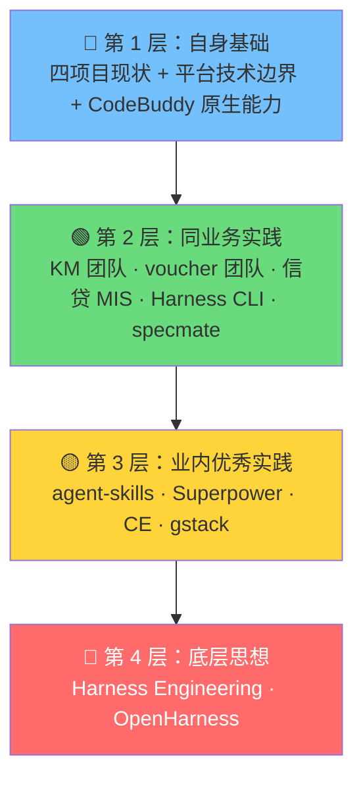
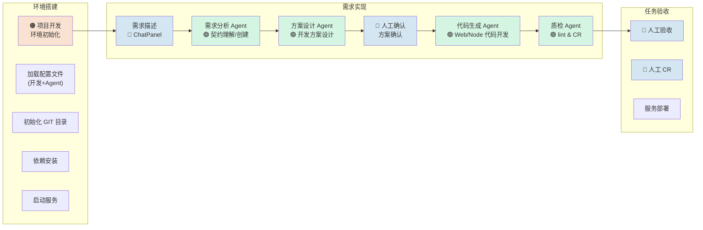

# 第 2 章：设计理念与参考来源

> **本章核心问题**：方案参考了谁？吸收了什么？筛掉了什么？为什么？
>
> **读完本章你会知道**：方案的 4 层参考来源体系、每个吸收点的三段式推理（来自哪里→解决什么→好处），以及那些被有意识筛掉的设计点和原因。

---

## 2.1 一个前提：方案不是拍脑袋拍出来的

本方案的每一个设计决策都有据可查。设计依据分两个维度：

- **内容来源**（方案设计的是什么）— 决定了流程怎么分、交付物怎么定、约束怎么写
- **落地方式**（方案怎么变成 AI 可执行的指令）— 决定了 Rules/Skills/Hooks/Memory 的写法

本章重点讲**内容来源**，落地方式在[第 5 章](ch05-infrastructure.md)详述。

---

## 2.2 四层参考来源

我们把参考来源分为 4 层，从最贴近业务到最抽象的思想：

### 每层解决什么问题

| 层 | 来源 | 回答的问题 | 产出 |
|---|------|-----------|------|
| **1. 自身基础** | 四项目现状 + XPage / XDC / XContract 技术边界 + CodeBuddy 原生能力 | 能做什么、不能做什么 | **约束条件** |
| **2. 同业务实践** | KM 团队（流程编排）+ voucher 团队（知识体系）+ 信贷 MIS（配置表）+ Harness CLI（回流机制）+ specmate（上下文治理） | 阶段怎么分、交付物怎么定、人机怎么分工 | **流程和结构设计** |
| **3. 业内优秀实践** | agent-skills + Superpower + CE + gstack | 反合理化、完成前验证、知识复利、前提挑战、任务粒度 | **具体机制** |
| **4. 底层思想** | Harness Engineering + OpenHarness | 约束 + 反馈 + 控制系统的统一框架 | **认知坐标** |

> **设计理由**：之所以分 4 层而不是一锅炖，是因为**不同层的参考价值不同**：第 1 层决定"能不能做"，第 2 层决定"怎么做"，第 3 层提供"做得更好的机制"，第 4 层提供"为什么要这么想"。混在一起容易分不清哪些是必须遵守的约束、哪些是可选的增强。

---

## 2.3 吸收策略与筛选原则

不是看到什么好就全搬进来。后续吸收外部经验时，按以下原则：

**三层看材料**：
1. **业务内实践层**：优先用来判断流程是否贴合真实业务研发场景
2. **通用工程方法层**：优先用来借鉴 Skill 结构、验证门禁、流程表达方式
3. **底层思想层**：优先用来统一认知坐标，不直接作为方案命名或落地模板

**四个筛选问题**（每次评估外部设计点时默认问）：
1. 它解决的是我们**哪个真实问题**？
2. 它属于**哪一层**参考来源？
3. 它是否适配当前 `CodeBuddy + Rules / Hooks / Memory / MCP + 契约驱动` 路线？
4. 它应该进入**正式方案、Rules、Memory**，还是仅保留参考？

> **设计理由**：这套筛选原则参考了我们实际分析 specmate 和开发知识库时的教训——如果不事先定好筛选标准，很容易"觉得什么都好"而过度引入，最后维护成本大于收益。

---

## 2.4 参考来源详解

### 第 1 层：自身基础

这一层不是"参考"，而是**约束条件**——决定了方案能做什么、不能做什么。

| 约束来源 | 具体约束 | 对方案的影响 |
|---------|---------|------------|
| 四项目现状 | 新旧并存，新模板从零搭建 | 流程面向新模板设计，旧项目仅作迁移参考 |
| XPage 平台 | 平台提供壳、路由跳转必须用 `window.wxpay.router` | 前端 Rules 必须写明平台约束 |
| XDC 框架 | Controller 由契约生成结构、无 Service 层 | 后端 Rules 必须写明"不要手写 Controller 签名" |
| XContract / OpenAPI | 接口定义通过契约管理 | 流程中"契约先行"不是可选的，是架构决定的 |
| CodeBuddy 原生能力 | 支持 Rules / Skills / Hooks / Memory / MCP | 优先用原生能力，不过早引入外部框架 |

> **好处**：先摸清约束再设计方案，避免"方案很好但落不了地"。

### 第 2 层：同业务实践

这一层贡献了方案的**主体结构**——流程怎么分、交付物怎么定、人机怎么分工。

#### KM 团队（tobytang）— 流程编排

> **来源**：[《从"跟AI聊"到"让AI按流程走"》](../references/从跟AI聊到让AI按流程走-团队研发工作流实践.md)

| 吸收点 | 来自哪里 | 解决什么问题 | 好处 |
|--------|---------|------------|------|
| **阶段化工作流 + 固定交付物** | KM 的 14 个 Skill 覆盖 ⓪~⑧ 全流程 | 流程不可控、产出不一致 | 团队任何人走同样流程，产出一致 |
| **四要素结构化规则** | 需求分析阶段的规则描述/满足时/违反时/边界条件 | 业务规则提取不完整，测试用例靠经验 | 测试用例可机械推导，覆盖率有保障 |
| **测试左移** | 编码前基于规则自动生成 AT/IT/E2E 三层用例 | 代码写完再补测试，覆盖不足 | SMS 案例：42 条用例在编码前就绪 |
| **契约先行** | tasks.md 契约任务排第 0 章 | AI 脑补接口形态 | 编码前接口定义已锁定 |

#### voucher 团队（cavanwan）— 知识体系

> **来源**：[《以 Code 为核心的开发模式实践》](../references/ai-dev-practice.md)

| 吸收点 | 来自哪里 | 解决什么问题 | 好处 |
|--------|---------|------------|------|
| **人机分工模型** | "设计阶段人主导、编码阶段 AI 主导" | 人机职责不清 | 每个阶段谁主导谁辅助有明确定义 |
| **代码第一性原则** | "能从代码获取的不重复堆进 Rules" | Rules 越来越臃肿 | Rules 只记录"代码看不出来但 AI 必须知道"的东西 |
| **任务提案作为 AI 上下文桥梁** | SDD 提案 × 组件知识 × 领域知识 × 规范 → 高质量代码 | AI 缺乏结构化上下文就会自由发挥 | 代码生成从"随机涌现"变为"可控标准输出" |
| **反馈飞轮** | 设计→开发→测试→提炼→下一次设计 | 做完就结束，知识不积累 | 每轮迭代让知识体系变厚一层 |

#### 信贷 MIS 团队 — 配置驱动 + Agent 协作体系

> **来源**：[CLAUDE.md 主配置](https://iwiki.woa.com/p/4018105585) · [UI Guide Skill](https://iwiki.woa.com/p/4018105655) · [Proto Inspector Skill](https://iwiki.woa.com/p/4018105662) · [Feature Planner Skill](https://iwiki.woa.com/p/4018105617)

信贷 MIS 是同业务中与我们项目最相似的实践（同为微信支付 MIS 系统，Vue 3 + XDC Node 技术栈），其体系的核心特点是**配置驱动 + Agent/Skill 三角协作**。下图是其完整的研发流水线：

> 🟠 自动化脚本 · 🔵 人工介入 · 🟢 Agent 执行
>
> *图片来源：信贷 MIS 团队内部实践文档*

| 吸收点 | 来自哪里 | 解决什么问题 | 好处 |
|--------|---------|------------|------|
| **子系统配置表** | CLAUDE.md 顶部的配置表（`SUBSYSTEM`/`VIEWS_DIR`/`BACKEND_DIR` 等 10 项配置键） | Skill 中硬编码项目路径，换子系统要改大量文件 | 配置键统一引用，切换子系统只改配置表，所有 Skill 自动适配 |
| **UI Guide Skill** | `credit-mis-ui-guide` 的 3 种核心布局模式（双栏表单查询型 / 查询表格型 / 多步骤表单型）+ 公共组件速查表 | AI 不知道该用哪种布局，每次生成的 UI 风格不一致 | 前端开发时有标准化布局模板可选，保持子系统间 UI 一致性 |
| **契约本地 vs 远程一致性检查** | `wxloan-proto-inspector` 的三步流程：查本地 proto → 查远程 xcontract → 对比差异 | 本地 proto-lib 版本过期导致字段缺失 | 编码前自动校验契约一致性，不一致时给出明确的处理建议 |
| **场景判断 + 方案生成** | `credit-mis-feature-planner` 的场景分类（纯前端 / 全栈）→ 自动收集下游契约 → 生成标准化技术方案 | 方案设计全靠人组织，质量参差 | AI 按标准模板生成方案，含后端 DTO/Service/Controller + 前端布局/组件/路由 |
| **Agent 三角协作** | CLAUDE.md 中的开发工作流：需求分析 Agent → 契约查询 Agent → 方案设计 Agent → 主 Agent 编码 | 单 Agent 上下文爆炸，又不知道何时该拆 | 每个 Agent 有明确分工，通过 Skill 衔接，上下文隔离 |
| **Git 分支规范** | CLAUDE.md §9 Git 操作指引：`personal/{feature_name}` 命名 + 多仓库同步 | AI 不知道在哪个仓库创建什么分支 | 嵌入 Rules 后 AI 自动按规范操作 Git |

> **对我们方案的影响**：信贷 MIS 的配置表结构直接启发了我们 `workspace-architecture` Rule 中的项目配置表设计；UI Guide Skill 启发了我们的 `ui-guide` Skill；场景判断逻辑被吸收进 `spec` Skill 的场景判断步骤；Agent 三角协作模式验证了 SubAgent 隔离的可行性。

##### 关注但选择不做的部分：LiveCoding 平台

信贷 MIS 团队在 CLAUDE.md + Skills 体系之上，还构建了一个完整的 **LiveCoding 全栈 AI 编码助手平台**（[技术文档](https://iwiki.woa.com/p/4019637501) · [需求路线图](https://iwiki.woa.com/p/4019636475)）。这是一个 NestJS + Vue 3 的 Web 应用，提供：

- **可视化 Chat 界面**：通过浏览器页面向 Agent 发需求，SSE 流式展示响应
- **需求 6 阶段流转**：澄清 → 设计 → 编码 → CR → 验收 → MR，支持 spec/free 两种模式
- **权限审批系统**：Agent 工具调用需用户在页面点击批准
- **工作区管理**：自动克隆仓库、安装依赖、启停服务
- **实时预览 + 交互式终端**：iframe 内嵌预览 + 浏览器终端

| 维度 | LiveCoding 平台方案 | 我们的方案 |
|------|---------------------|-----------|
| **交互入口** | 浏览器 Web 页面 | IDE（CodeBuddy）原生对话框 |
| **运行环境** | 开发机（AnyDev），通过 Web 远程访问 | 同样基于开发机，但直接在 IDE 中操作 |
| **流程编排** | 平台代码实现（NestJS Controller + 前端 Store） | Rules + Skills + Hooks（声明式配置） |
| **权限控制** | 自建审批系统（三层架构 + 持久化规则） | CodeBuddy 原生权限机制 |
| **成本** | 需开发和维护一个全栈 Web 应用 | 零额外应用开发成本 |

**我们选择不做平台的理由**：

1. **没有必要在页面编辑**——开发者的主战场是 IDE，在浏览器中编辑代码是一个"多出来的中间层"，增加了上下文切换成本
2. **CodeBuddy 原生能力已经覆盖**——对话、文件编辑、终端执行、预览，IDE 内都有，不需要重新发明轮子
3. **声明式优于编程式**——Rules/Skills/Hooks 是配置文件，修改成本远低于改 NestJS Controller 代码
4. **维护成本差异巨大**——一个全栈 Web 应用需要持续的前后端维护，而配置文件几乎零维护成本

> **总结**：信贷 MIS 团队的 CLAUDE.md + Skills 体系（第一层）我们充分吸收，但 LiveCoding 平台（第二层）我们选择了不同路径——**同样基于开发机，但用 IDE 原生能力 + 声明式配置替代 Web 平台**。这是一个有意识的取舍，不是"做不到"，而是"没必要"。

#### Harness CLI（zipsu）— 回流机制

> **来源**：[Harness CLI 文档](../Harness-CLI-AI驱动的需求开发自动化流水线.md)

| 吸收点 | 来自哪里 | 解决什么问题 | 好处 |
|--------|---------|------------|------|
| **验证失败多级回流** | VERIFY_GATE 5 种判定 + FIX_LOOP 4 级根因分类 | "前进路径完整，后退路径空白" | 问题出在哪一层就回到哪一层修 |
| **AI 代码库搜证** | answer 命令（逐个分析问题 → 搜索代码库 → 更新确认状态） | 需求分析中待确认问题全靠人回答 | AI 先在代码中找答案，找不到才标"待人工确认" |
| **DoD + 回退策略** | 里程碑结构中每个任务的完成定义和回退策略 | 任务拆解只说"做什么"不说"做到什么程度算完" | 每个任务有明确的完成标准和失败预案 |
| **需求就绪度评级** | clarification_readiness 字段（HIGH/MEDIUM/LOW） | 不知道需求说清楚了没有就往下走 | LOW 时不建议进入 spec，量化了"需求是否就绪" |

#### specmate — 执行层治理

| 吸收点 | 判断 | 原因 |
|--------|------|------|
| SubAgent 上下文隔离 | **可直接吸收** | 与 CodeBuddy SubAgent 能力兼容，降低上下文污染 |
| P0/P1/P2 分级澄清 | **条件吸收** | 方向正确，但需真实需求验证后再写入正式 Skill |
| 4 步精简流程 | **条件吸收** | 适合作为执行层快捷入口，但不替换 6 阶段闭环 |
| `planning.md` 批次执行 + 门禁 | **可直接吸收** | 与"逐任务执行、完成前验证"原则一致 |
| `specs/` 主仓模式 | **仅保留参考** | 当前沉淀对象仍是 Rules/Memory，不急于新增 specs 主仓 |

> **注意**：specmate 应拆成两部分看——**执行层流程治理**（4 步流程、澄清分级、上下文治理）和**复杂存量系统知识底座**（开发知识库）。前者解决"流程太重、AI 易跑偏"，后者解决"找不到、看不懂、做不对"。

### 第 3 层：业内优秀实践

这一层贡献了**具体机制**——让流程更可靠的技术手段。

四个主流框架的对比：

| 维度 | agent-skills (addyosmani) | Superpower (obra) | CE (EveryInc) | gstack (garrytan/YC) |
|------|--------------------------|-------------------|---------------|---------------------|
| **核心思维** | 工程技能标准化 | 流程纪律 | 知识复利 | 产品打磨 + 角色模拟 |
| **最强设计** | 反合理化 + 五轴代码审查 | TDD 强制 + 完成前验证 + 子代理审查 | 做完即沉淀 + 80/20 原则 | 灵魂拷问 + 学习记录四分类 |
| **最弱点** | 较松散，缺乏端到端流程 | 小任务流程太重 | 改进建议易不痛不痒 | 偏产品/创业场景 |

#### 已吸收的关键设计点

| 设计点 | 来自 | 解决什么 | 好处 | 体现在 |
|--------|------|---------|------|--------|
| **完成前验证必须有证据** | Superpower | AI 说"应该能过"但实际没跑测试 | 每步完成都有运行命令+输出证据 | delivery-workflow Rule |
| **反合理化机制** | agent-skills + Superpower | AI 说"太简单不用 spec" | AI 不能为跳步找理由 | coding Skill 禁止项 |
| **需求阶段主动挑战假设** | gstack `/office-hours` | 被动提取需求，遗漏前提错误 | 主动追问"这是对的问题吗？" | requirement-analysis Skill |
| **学习记录四分类** | gstack `/learn` | Memory 是一个大杂烩 | 按 Patterns/Pitfalls/Preferences/Architecture 分类 | archiving Skill + memory-capture-template |
| **做完即沉淀** | CE `/ce:compound` | 做完就结束，不提炼 | 每次需求完成自动触发归档 | archiving Skill |
| **80/20 计划审查原则** | CE | 编码占用过多精力 | 80% 精力在计划和审查，20% 在执行 | 人机分工模型理论支撑 |
| **安全护栏** | gstack `careful`/`freeze`/`guard` | AI 执行高危命令 | pretool_guard 拦截 rm -rf 等 | pretool_guard Hook |
| **任务粒度控制** | Superpower（2-5 分钟/任务） | 任务太大 AI 容易偏离 | 每个任务有具体文件路径和验证步骤 | design Skill |

#### 关注但当前不急于吸收的设计点

这些设计点方向正确，但当前条件不具备或优先级不高：

| 设计点 | 来自 | 不急于吸收的原因 |
|--------|------|----------------|
| TDD 强制红绿循环 | Superpower | 当前项目测试基础设施未建立 |
| 子代理两阶段审查 | Superpower | 需要多 Agent 支持，当前不是第一优先级 |
| 跨模型交叉审查 | gstack | 不具备多模型条件 |
| 发散式改进发现 | CE `/ce:ideate` | 改进应来自真实验证而非 AI 发散 |
| 步骤级回溯 + 产物清理 | Harness CLI | 我们基于 Skill 链不是状态机，产物管理方式不同 |
| JSONL 轨迹追踪 | Harness CLI | 当前用 context/current-task.md 轻量跟踪足够 |
| Web 平台化（可视化 Chat + 权限审批） | 信贷 MIS LiveCoding | 开发主战场在 IDE，不需要额外的 Web 编辑入口 |
| E2E AI 自动化测试 | 信贷 MIS LiveCoding 路线图 P1 | 方向正确，待测试基础设施就绪后可吸收（Playwright 集成思路） |
| AI 日志分析系统 | 信贷 MIS LiveCoding 路线图 P1 | 需要日志收集基础，可通过 MCP 接入替代自建 |

> **设计理由**：列出"不吸收"的设计点同样重要——它记录了"为什么没用"，避免后续有人重新评估时从零分析。

### 第 4 层：底层思想

#### Harness Engineering

> **来源**：OpenAI 博文 + OpenHarness 仓库

`Harness Engineering` 是 2026 年 AI 工程圈的热门话题。核心理念：

> **模型提供智能，Harness 提供约束、反馈和控制系统。**

同一个模型，换一套 Harness，编程基准成功率从 42% 跳到 78%。模型没换，数据没换，提示词也没换——**Harness 带来的提升，相当于换了一代模型。**

映射到我们的方案：

| Harness 概念 | 我们的落地载体 |
|-------------|-------------|
| 约束（Constraints） | Rules — 告诉 AI "你该怎么干活" |
| 控制（Control） | Hooks — 运行时拦截高危操作 |
| 反馈（Feedback） | Memory + 归档 — 经验积累反哺下一轮 |
| 计划（Plan） | Skills — 阶段化执行指令 |
| 验证（Verify） | 完成前验证 + 门禁检查 |

> **定位**：Harness Engineering 只作为**认知坐标**——帮助理解"为什么要这么想"，但不作为方案正式命名，也不直接照搬 OpenHarness 的实现。

#### 落地方式参考

方案的落地方式（怎么把设计"翻译"成 AI 可执行指令）参考了 OpenHarness 的写法：

| 载体 | 面向 | 写法参考 |
|------|------|---------|
| Rules | AI | OpenHarness 的 `CLAUDE.md`：祈使句、精简、可执行 |
| Skills | AI（按阶段加载） | CodeBuddy 原生 Skills 系统 + OpenHarness 按需加载思路 |
| Hooks | AI 运行时 | OpenHarness 的 `PreToolUse` / `PostToolUse` 拦截模式 |
| Memory | AI 上下文 | OpenHarness 的索引 + 主题文件拆分 |

---

## 2.5 本章小结

| 要点 | 内容 |
|------|------|
| 方案不是拍脑袋 | 每个设计点都有据可查的参考来源 |
| 4 层参考来源 | 自身基础 → 同业务实践 → 业内优秀实践 → 底层思想 |
| 筛选原则 | 4 个问题：解决什么真实问题？属于哪一层？适配当前路线吗？进方案还是仅参考？ |
| 吸收 ≠ 照搬 | 每个来源只取适合当前场景的部分，不适合的也记录原因 |
| Harness Engineering | 认知坐标，不是方案命名 |

---

> **下一章**：[第 3 章：全流程设计](ch03-workflow.md) — 6 个阶段各做什么？人和 AI 怎么分工？
