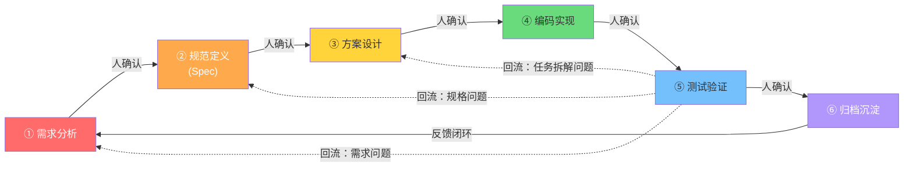
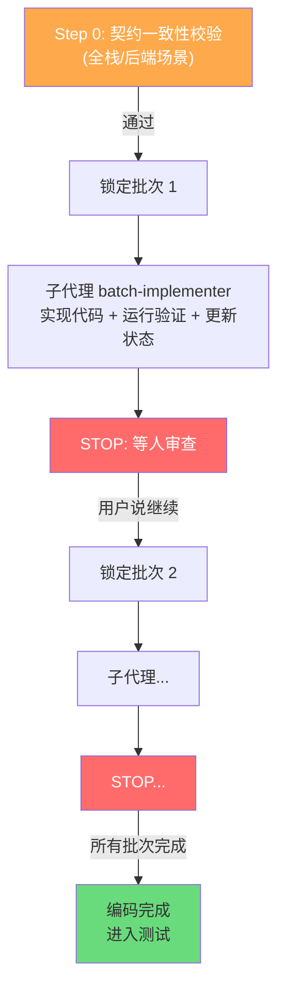
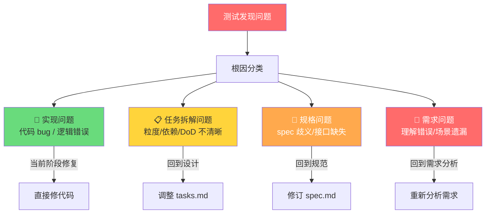
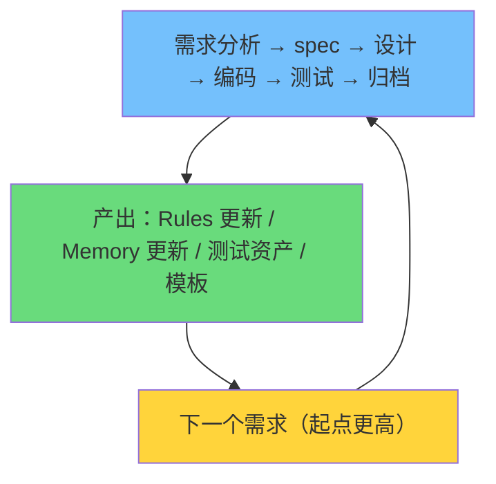

# 第 3 章：全流程设计

> **本章核心问题**：6 个阶段各做什么？人和 AI 怎么分工？每个阶段出什么？
>
> **读完本章你会知道**：完整的 6 阶段工作流、每个阶段的输入/约束/交付物、人机分工模型，以及每个阶段设计背后的推理。

---

## 3.1 流程全景

一个新需求从进来到归档，分为 **6 个阶段**。每个阶段之间都有**人工门禁**——AI 产出交付物后必须请人确认，确认后才能进入下一阶段。



**三种任务类型**（进入流程前先判断）：

| 类型 | 适用场景 | 走哪些阶段 |
|------|---------|-----------|
| **Implement** | 新需求 / 新功能 | 完整 6 阶段 |
| **Fast-fix** | 修 bug / 小改动 | 跳过 ①②③，直接 ④→⑤→⑥ |
| **Review-only** | 代码审查 / 方案评审 | 只读不写，产出审查意见 |

> **溯源**：任务分类是我们第一版就有的设计。`KM` 团队用 14 个 Skill 覆盖 ⓪~⑧ 全流程，我们精简为 6 阶段（合并了探索、验收等步骤），同时增加了 Fast-fix 短路模式，适配"明确 bug 不需要走全流程"的真实场景。

---

## 3.2 人机分工模型

| 阶段 | 人的角色 | AI 的角色 |
|------|---------|----------|
| ① 需求分析 | **主导**：确认业务目标、补充隐性约束 | 辅助：结构化需求、提取规则、主动挑战假设 |
| ② 规范定义 | **主导**：审查 spec 各章节、确认接口定义 | 辅助：生成 spec 草案 |
| ③ 方案设计 | **主导**：审查任务拆解、关键决策 | 辅助：梳理现状、生成任务清单 |
| ④ 编码实现 | 辅助：审查代码、补充领域知识 | **主导**：按任务清单逐步生成代码 |
| ⑤ 测试验证 | 辅助：确认前置条件、验收结果 | **主导**：生成测试用例、执行测试 |
| ⑥ 归档沉淀 | **主导**：确认沉淀内容的准确性 | 辅助：提炼规则更新、记忆更新 |

**规律**：前三个阶段（定义"做什么"）人主导；后三个阶段（执行"怎么做"）AI 主导。

> **溯源**：人机分工模型参考 `voucher` 团队的实践——"设计阶段人主导 AI 辅助梳理现状；开发测试阶段 AI 主导、人辅助审查补充"。他们发现方案设计需要业务判断和架构决策，AI 在这一步更适合辅助；而编码和测试是规则性更强的工作，AI 在有结构化上下文的情况下可以稳定输出。
>
> `CE (Compound Engineering)` 的 80/20 原则进一步佐证了这个模型——80% 精力应在计划和审查上（人主导的前三个阶段），编码执行只占 20%。

---

## 3.3 假设场景

后续每个阶段将用以下典型场景来具象化说明：

> **在 `mmpayproductpermissionhtml` 上新增一个"待处理订单查询"页面，对应在 `mmpayxdcproductpermissionweb` 上新增查询接口，接口需调用下游 Svrkit 服务获取订单数据。**

这是一个**全栈需求**——前端新增页面 + 后端新增接口，正好能展示全流程每个阶段的产出。

---

## 3.4 阶段一：需求分析

### 解决什么问题

如果直接把产品需求描述丢给 AI 让它写代码，AI 会脑补接口字段、遗漏业务规则、忽略异常流程。`KM` 团队的 SMS 案例数据表明：PRD 明确写出的规则只有 6 条，AI 通过结构化穷举补全了 5 条（45%）——这些遗漏的规则如果到编码阶段才发现，返工成本远高于前置分析。

### 输入 → 约束 → 交付物

| 输入 | 约束 | 交付物 |
|------|------|--------|
| 产品需求描述 | 每条业务规则必须结构化为**四要素**（规则描述 / 满足时行为 / 违反时行为 / 边界条件）；必须做前提挑战 | `requirement-analysis.md` |

### AI 具体做什么

1. **前提挑战**（3 个必答问题）：
   - 这是对的问题吗？
   - 如果什么都不做会怎样？
   - 现有代码中有哪些可以复用的？

2. **代码库搜证**：在旧前端/后端代码搜索相关接口、常量、枚举。找到证据 → 标"已从代码确认"并附文件路径+行号；找不到 → 标"待人工确认"。

3. **穷举式规则提取**（5 种策略）：CRUD 补全 / 正反面 / 边界值 / 异常流 / 交叉影响。

4. **需求就绪度评级**：对 5 个维度（业务目标、功能点完整性、业务规则、异常流程、待确认问题）逐一标注 ✅/⚠️/❌，输出 **HIGH** / **MEDIUM** / **LOW** 评级。LOW 时不建议进入 spec。

### 场景示例

> **"待处理订单查询"需求分析：**
> - 前提挑战：旧前端 `depositmisview` 是否已有类似查询页面？→ 确认需要新建
> - 代码库搜证：在旧后端找到订单查询相关 Svrkit 调用 → 标"已从代码确认"
> - 提取功能点：查询条件（时间范围、状态、商户号）、分页、导出
> - 穷举规则：时间范围上限 90 天、分页大小限制、无结果提示
> - 人确认：补充"只能查询本组织下的订单"（PRD 未写明的权限约束）
> - 就绪度：HIGH → 可进入 spec

### 设计溯源

| 机制 | 来自 | 好处 |
|------|------|------|
| 四要素结构化 | KM 团队 | 测试用例可机械推导，覆盖率有保障 |
| 穷举式补全 | KM 团队（5 种策略） | 主动发现 PRD 未写明的隐藏规则 |
| 前提挑战 | gstack `/office-hours` | 减少后续返工，在源头纠正方向性错误 |
| 代码库搜证 | Harness CLI `answer` 命令 | AI 先找答案，找不到才问人，减少确认轮次 |
| 就绪度评级 | Harness CLI `clarification_readiness` | 量化"需求说清楚了没有"，LOW 时不允许盲目往下走 |

---

## 3.5 阶段二：规范定义（Spec）

### 解决什么问题

需求分析产出了功能点和规则，但如果直接让 AI 写代码或拆任务，AI 会自己决定接口形态、文件放哪、错误怎么处理——这些决定没经过人确认，写完才发现"不是我想要的"→ 返工。

> `agent-skills` 的核心观察：**"Code before spec is the #1 cause of wasted work."**
> `Superpower` 和 `gstack` 也有一致结论——无论任务多简单，都必须先有 spec 再写代码。

### 输入 → 约束 → 交付物

| 输入 | 约束 | 交付物 |
|------|------|--------|
| `requirement-analysis.md` + 项目 Rules | 5 个必选章节；禁止 TBD/待定；只定义"做什么"，不拆任务、不写代码 | `spec.md` |

### 场景判断（先做）

Spec Skill 会先判断需求属于哪种场景，这决定了 §2 和 §3 的侧重点：

| 场景 | §2 接口定义侧重 | §3 文件规划侧重 |
|------|---------------|---------------|
| **纯前端** | 页面路由、组件层次、数据流 | 仅前端文件 |
| **纯后端** | API 路径、参数、响应、错误码 | 仅后端文件 |
| **全栈** | 同时定义 API 和页面路由 | 前后端两组文件 |

### 5 个必选章节

| 章节 | 内容 | 来源 |
|------|------|------|
| **§1 目标** | 一句话描述 + 成功标准 | agent-skills "Goals" |
| **§2 接口定义** | API 路径/方法/参数/响应/错误码；或页面路由/组件/数据流 | agent-skills "Commands"（适配为"接口定义"以匹配 XDC/OpenAPI） |
| **§3 文件规划** | 新建文件+职责 / 修改文件+修改点 | agent-skills "Structure" + Superpower（先 map files 再写任务） |
| **§4 测试策略** | 正向/反向/边界/权限 | agent-skills "Tests" + KM 团队测试左移 |
| **§5 约束与边界** | 技术约束/业务约束/Out of Scope | agent-skills "Boundaries" + gstack（明确标注 Out of Scope） |

### 场景示例

> **"待处理订单查询" spec：**
> - 场景判断：全栈（前端新增页面 + 后端新增接口）
> - §1：在运营后台新增"待处理订单查询"，支持按时间/状态/商户号查询，分页展示
> - §2：`GET /api/pending-orders`，请求参数（start_date/end_date/status/page/page_size），响应（total/list[]），错误码（参数校验失败/无权限/下游超时）
> - §3：后端新增 `pending-orders-controller.ts`；前端新增 `pending-orders/` 目录 + 路由注册
> - §4：正向（正常查询）、反向（超 90 天）、边界（分页极值）、权限（非本组织）
> - §5：不做导出功能（Out of Scope）、下游超时需降级处理

### 设计溯源

| 机制 | 来自 | 好处 |
|------|------|------|
| spec 独立于 design | agent-skills + Superpower + gstack（三方一致） | "定义做什么"和"规划怎么做"分开审查 |
| spec 是唯一锚点 | 我们自己的显式表达（三方实质一致） | 后续所有阶段都锚定 spec |
| 禁止占位符 | Superpower `writing-plans` | 确保 spec 每一项都是确定的 |
| 场景判断 | 信贷 MIS 团队 | 避免全栈模板套在纯前端需求上 |

---

## 3.6 阶段三：方案设计

### 解决什么问题

spec 定义了"做什么"，但还需要一层**结构化上下文桥梁**，才能稳定驱动代码生成。直接从 spec 到编码，AI 会缺乏执行粒度——不知道先做什么、后做什么、每步做到什么程度。

### 输入 → 约束 → 交付物

| 输入 | 约束 | 交付物 |
|------|------|--------|
| `spec.md` + 项目 Rules + 现有代码 | 契约任务排最前；所有任务可追溯到 spec；任务含 DoD + 回退策略 | `tasks.md`（+ 可选 `design-notes.md`） |

### 关键机制

**澄清分级**（由子代理 `design-clarifier` 执行）：

| 级别 | 处理方式 |
|------|---------|
| **P0** — 阻塞性问题 | 必须请人确认，不能继续 |
| **P1** — 代码搜证后仍不确定 | 提交给人判断 |
| **P2** — AI 可自动决策 | 记录决策理由，不打断流程 |

**tasks.md 格式**：每个任务必须包含 5 个字段：

```markdown
- [ ] **任务名称**
  - 文件：具体文件路径
  - 内容：要做什么
  - DoD：做到什么程度算完（普通列表，不嵌套勾选框）
  - 验证：怎么验证
  - 回退：做砸了怎么退
```

**批次划分**：任务按批次组织，契约与高风险依赖放最前。小需求 1 批次，中等 2-3 批次，复杂 ≤5 批次。

### 设计溯源

| 机制 | 来自 | 好处 |
|------|------|------|
| 契约先行（排第 0 章） | KM 团队 | AI 不用脑补接口形态 |
| 任务提案作为结构化上下文 | voucher 团队 SDD | 代码生成从"随机涌现"变为"可控输出" |
| DoD + 回退策略 | Harness CLI 里程碑结构 | 每个任务有明确完成标准和失败预案 |
| 澄清分级 | specmate P0/P1/P2 | 阻塞性问题才打断，其余自动决策记录 |
| 批次执行 + 门禁 | specmate `planning.md` | 用户可按批次审查，不用等全部做完 |
| 任务依赖关系图 | mkt 团队 OpenSpec 实践 | 标注任务间前后依赖和可并行关系，辅助审查和排序 |

---

## 3.7 阶段四：编码实现

### 解决什么问题

有了 spec 和任务清单，AI 有了明确的执行上下文。但如果没有项目规范约束，AI 仍然会用错框架调用方式、违反目录结构、产出不一致的代码风格。

### 输入 → 约束 → 交付物

| 输入 | 约束 | 交付物 |
|------|------|--------|
| `tasks.md` + `spec.md` + Rules | 契约先行；逐批次执行；完成前必须出示证据；8 条禁止项 | 符合契约的前后端代码 |

### 执行模型



**Step 0 契约校验**（全栈/后端场景必做）：
1. 检查 `openapi.yaml` 中是否已有对应接口
2. 本地契约与 spec §2 不一致则先更新
3. 用 XContract MCP 查询远程契约确认一致
4. 有差异则提醒人确认方向
5. **校验通过后才能编码**

### 8 条禁止项

| # | 禁止内容 | 来源 |
|---|---------|------|
| 1 | 禁止无证据声称"应该能过" | Superpower `verification-before-completion` |
| 2 | 禁止 TBD / TODO | Superpower `writing-plans` |
| 3 | 禁止"与任务 N 类似"等模糊引用 | Superpower `writing-plans` |
| 4 | 禁止测试前声称完成 | Superpower `verification-before-completion` |
| 5 | 禁止未经要求的额外重构/注释 | Claude Code system prompt（避免过度工程） |
| 6 | 禁止"顺手"提前推进下一批次 | 我们自创（防止跳过门禁） |
| 7 | 禁止修改未读的文件 | Claude Code system prompt（未读勿改） |
| 8 | 禁止创建不必要的新文件 | Claude Code system prompt（删除优于保留） |

### 设计溯源

| 机制 | 来自 | 好处 |
|------|------|------|
| Rules 即规范手册 | voucher 团队 | AI 不知道的规范就会反复违反，写成 Rules 自动加载 |
| 逐任务执行不跳步 | agent-skills 反合理化 + Superpower 任务粒度 | 防止 AI 说"先写完再补测试" |
| 完成前必须出示证据 | Superpower `verification-before-completion` | 每步完成都有命令输出+退出码作证 |
| Hooks 运行时守护 | gstack `careful`/`freeze`/`guard` | pretool_guard 拦截高危命令 |
| 避免过度工程（禁止项 5-8） | Claude Code system prompt | 保持代码最小复杂度 |

---

## 3.8 阶段五：测试与验证

### 解决什么问题

代码写完后，如果没有前置的测试设计，测试覆盖度完全依赖编码者的经验。`KM` 团队的做法是把测试左移到编码前：基于四要素规则，测试用例可以机械推导。

### 输入 → 约束 → 交付物

| 输入 | 约束 | 交付物 |
|------|------|--------|
| `requirement-analysis.md`（四要素规则）+ 已实现代码 | 覆盖所有规则的正向/反向/边界场景；附带命令输出证据 | `test-cases.md` + 验证结果 |

### 测试用例推导逻辑

| 规则要素 | 推导出的测试 |
|---------|------------|
| 满足时行为 | 正向测试用例 |
| 违反时行为 | 反向测试用例 + 错误码验证 |
| 边界条件 | 边界值测试（阈值 ±1） |

### 验证失败回流机制

这是本方案的一个**关键设计**——测试发现问题时，不是默认"改代码再跑"，而是先做根因分类：



**关键原则**：跨层问题**优先归到更上层**，从根本解决，避免代码层反复打补丁。

### 设计溯源

| 机制 | 来自 | 好处 |
|------|------|------|
| 测试左移 | KM 团队 | 编码前用例就绪，覆盖率有保障 |
| 完成前验证必须有证据 | Superpower | 禁止"应该能过"，必须附带命令输出 |
| 多级回流 | Harness CLI VERIFY_GATE + FIX_LOOP | 填补了"前进完整、后退空白"的设计缺口 |
| 4 级根因分类 | Harness CLI FIX_LOOP | 不同层级的问题回到不同层级修 |

---

## 3.9 阶段六：归档与沉淀

### 解决什么问题

需求做完后，如果不做沉淀，下一次需求又从零开始。

### 输入 → 约束 → 交付物

| 输入 | 约束 | 交付物 |
|------|------|--------|
| 全部过程产物 + 现有 Rules/Memory | delta-first 策略（先生成变化点草稿，人确认后才写入基线）；只沉淀长期有效的经验 | Rules 更新 + Memory 更新（四分类）+ 模板更新 |

### delta-first 策略

归档不直接修改基线文件，而是：

1. 子代理 `archiving-delta-synthesizer` 对照现有 Rules/Memory/模板，整理出**仅包含变化点**的 `archiving.delta.md`
2. 展示 delta 给人审查 → **STOP**
3. 人确认后，才将变化点写入基线

> **好处**：避免 AI 把临时讨论误沉淀为长期知识，也避免覆盖掉现有正确的规则。

### Memory 四分类

| 分类 | 内容 | 举例 |
|------|------|------|
| **Pattern** | 可复用的模式 | 分页查询的参数校验逻辑 |
| **Pitfall** | 踩坑记录 | 下游 Svrkit 超时需做降级 |
| **Preference** | 偏好约定 | 查询接口统一用 `GET /api/{resource}` |
| **Architecture** | 架构决策 | 前后端通过 OpenAPI 契约对齐 |

### 设计溯源

| 机制 | 来自 | 好处 |
|------|------|------|
| 反馈闭环 / 知识飞轮 | voucher 团队 | 每轮迭代让知识体系变厚一层 |
| 做完即沉淀 | CE `/ce:compound` | 不是做完就结束，而是做完就提炼 |
| 四分类管理 | gstack `/learn` | 不是大杂烩，按模式/陷阱/偏好/架构分类 |
| delta-first | 开发知识库"基准文档增量更新"思路 | 只审查 diff，降低维护成本 |
| 代码第一性 | voucher 团队 | 能从代码获取的不重复堆进 Rules |
| Spec 活文档 | voucher/mkt 团队 OpenSpec | 归档时合并能力描述到持久化主线，AI 有演进视图 |
| 知识排除原则 | voucher 团队知识提炼策略 | 代码能表达的不文档化，防止 Memory 臃肿 |

---

## 3.10 反馈闭环

全流程不是线性单次执行，而是一个**持续收敛的循环**：



每次需求完成后，归档阶段产出的更新直接改善下一次需求的执行质量：

| 积累项 | 效果 |
|--------|------|
| **Rules 更准** | 新发现的约束被补进规则，AI 下次不再犯同样的错 |
| **Memory 更厚** | 长期经验积累，AI 的起始上下文更丰富 |
| **测试资产更全** | 边界条件不断补充，覆盖度持续提升 |
| **模板更成熟** | 可复用的任务模式被提炼为标准模板 |

> **溯源**：这就是 `voucher` 团队所说的"飞轮效应"——第一个需求最慢（知识从零开始），后续同类需求越来越快（前面积累的 Rules、Memory、测试资产都在复利）。

---

## 本章小结

| 要点 | 内容 |
|------|------|
| 6 阶段流程 | 需求分析 → spec → 设计 → 编码 → 测试 → 归档 |
| 人机分工 | 前三阶段人主导，后三阶段 AI 主导 |
| 人工门禁 | 每个阶段之间都有人确认，AI 不能自行跳过 |
| 回流机制 | 测试发现问题按 4 级根因分类，回到对应层级修 |
| 反馈闭环 | 每轮做完归档沉淀，下一轮起点更高 |
| 3 种任务类型 | Implement（全流程）/ Fast-fix（短路）/ Review-only（只读） |

---

> **下一章**：[第 4 章：三大核心机制](ch04-core-mechanisms.md) — 契约先行、验证回流、知识飞轮是怎么运作的？
