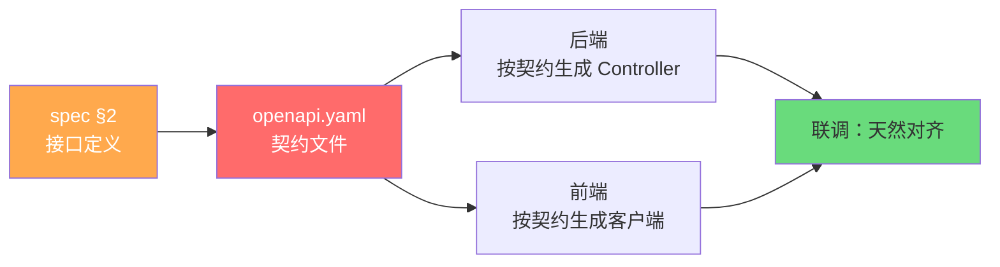
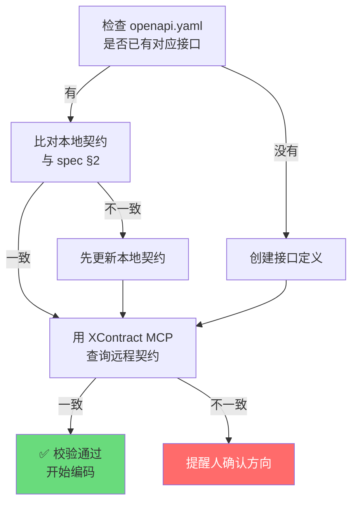
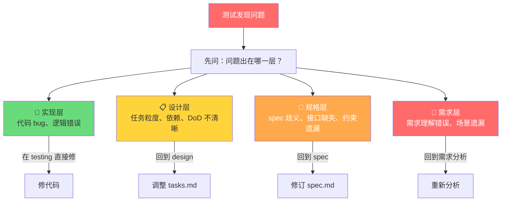
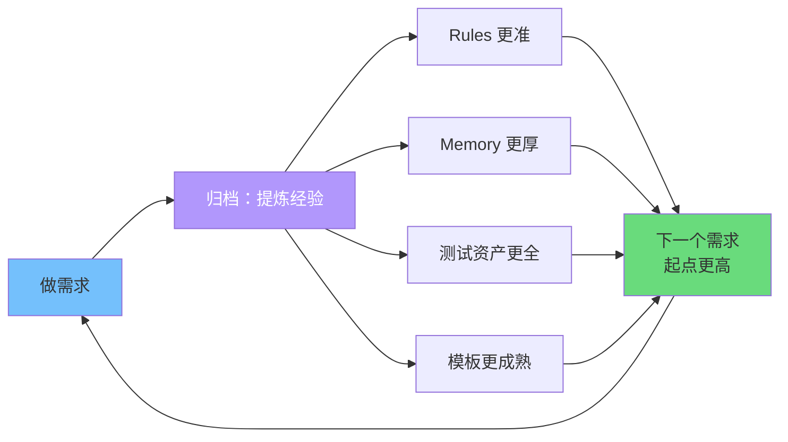
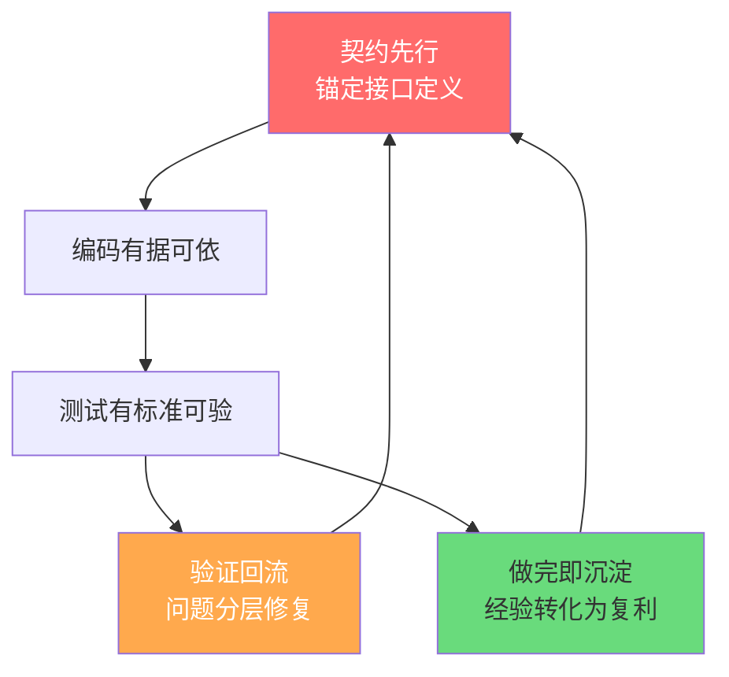

# 第 4 章：三大核心机制

> **本章核心问题**：契约先行、验证回流、知识飞轮——这三个贯穿全流程的机制是怎么运作的？
>
> **读完本章你会知道**：三大机制各自解决什么问题、在流程中如何体现、为什么比常见做法更好。

---

## 为什么单独讲三大机制？

第 3 章按阶段讲了全流程，但有三个机制是**跨阶段的**——它们不属于某一个阶段，而是贯穿整个流程的"基础设施"。单独讲清楚它们，有助于理解流程设计的内在逻辑。

| 机制 | 贯穿哪些阶段 | 核心作用 |
|------|------------|---------|
| 契约先行 | spec → design → coding → testing | 接口定义锚定全流程 |
| 验证失败多级回流 | testing → 可回流到任意上游阶段 | 问题在正确的层级修复 |
| 做完即沉淀 | archiving → 反馈到下一轮所有阶段 | 经验转化为复利 |

---

## 4.1 契约先行

### 它解决什么问题

在没有契约先行的情况下，一个典型的开发流程是：

```
产品提需求 → 前端先写页面 → 后端再写接口 → 联调时发现接口不对 → 改 → 再联调
```

前后端各自理解需求，接口定义"口头约定"，联调阶段才发现字段名不一致、响应结构不同、错误码没对齐。

### 契约先行怎么运作



**在流程中的体现**：

| 阶段 | 契约相关动作 |
|------|------------|
| **spec**（§2 接口定义） | 定义接口路径、参数、响应、错误码 |
| **design**（tasks.md §0） | 契约任务排第 0 章，最先执行 |
| **coding**（Step 0） | 编码前做契约一致性校验（本地 vs spec，本地 vs 远程） |
| **testing** | 契约校验作为验证前置条件 |

**为什么契约任务排第 0 章？**

> **溯源**：参考 `KM` 团队的做法——tasks.md 中契约任务排第 0 章，AI 不用脑补接口形态。这与我们的 `XDC / XContract` 机制天然匹配：先定义 `openapi.yaml`，再生成代码骨架。

**coding 阶段的 Step 0 校验流程**：



### 好处

| 对比维度 | 没有契约先行 | 有契约先行 |
|---------|------------|----------|
| 接口定义 | 口头约定或文档散落 | `openapi.yaml` 单一真相源 |
| 前后端对齐 | 联调时才发现不一致 | 编码前就锁定 |
| AI 编码 | AI 脑补接口形态 | AI 按契约生成，不用猜 |
| 变更追踪 | 改了接口但忘更新文档 | 契约即文档，改契约就是改文档 |

---

## 4.2 验证失败多级回流

### 它解决什么问题

大多数 AI 工作流的问题处理方式是：**测试失败 → 改代码 → 再测试**。

但实际上，很多问题**不是代码层面能修的**：
- spec 定义就有歧义 → 改代码只是在歧义上打补丁
- 需求理解有误 → 改代码改的是"错误的需求"
- 任务拆解不合理 → 在错误的粒度上反复修

如果只有"前进路径"没有"后退路径"，就会出现：在编码阶段反复修 bug，越修越乱，最后不得不推翻重来。

> **溯源**：这填补了我们之前"前进路径完整、后退路径空白"的设计缺口。参考了 `Harness CLI`（zipsu）的 VERIFY_GATE 5 种判定 + FIX_LOOP 4 级根因分类。

### 回流怎么运作

当测试阶段发现问题时，**先分类、再决定去哪修**：



**关键原则**：

> 如果一个问题既像实现问题又像规格问题，**优先归类到更上层**（规格 > 实现），因为上层修复能从根本解决问题，避免反复修补。

**回流时必须说明 3 件事**：
1. 回到哪个阶段
2. 为什么不是代码层能修的
3. 回流后重点关注什么

### 对比：单层修复 vs 多级回流

| 维度 | 单层修复（只改代码） | 多级回流 |
|------|-------------------|---------|
| 发现 spec 有歧义 | 在代码里"猜测"正确行为 | 回到 spec 阶段，先把定义改对 |
| 发现需求遗漏场景 | 在代码里"补丁式"增加处理 | 回到需求分析，完整补充后走全流程 |
| 修复效果 | 可能修对了，也可能只是掩盖问题 | 从根本修复，后续不再复现 |
| 修复成本 | 短期低，长期高（反复返工） | 短期高（要回退），长期低（一次修对） |

### 好处

- **避免代码层反复打补丁**：上层问题在上层修
- **修复可追溯**：回流有明确的分类和理由
- **提高一次通过率**：从根本解决意味着后续测试不会反复失败

---

## 4.3 做完即沉淀（知识飞轮）

### 它解决什么问题

如果每次需求做完就结束，下一次需求又从零开始——AI 不记得上次的经验，同样的坑可能再踩一遍。

### 飞轮怎么运作



**具体产出**：

| 每轮产出 | 对下一轮的价值 |
|---------|-------------|
| **Rules 新增/更新** | AI 下次自动遵守新发现的约束 |
| **Memory（Pattern）** | 类似需求可直接复用已有模式 |
| **Memory（Pitfall）** | AI 下次不会踩同样的坑 |
| **Memory（Preference）** | 命名、结构等偏好一致 |
| **Memory（Architecture）** | 架构决策有据可查 |
| **模板更新** | 可复用的任务模式效率递增 |
| **测试资产** | 边界条件不断补充，覆盖度持续提升 |
| **Spec 主线更新** | AI 下次能看到已部署能力的演进视图，不从零理解 |

### delta-first 策略

归档不是"AI 想写什么就写什么"，而是有**受控的增量更新**：

1. 子代理对照现有基线，生成**仅包含变化点**的 delta
2. 展示 delta → **STOP** → 人审查
3. 人确认后才写入基线

### 知识排除原则

> 来源：voucher/mkt 团队 OpenSpec 知识文档提炼策略。

并非所有经验都值得沉淀。以下内容**不进** Memory：
- **代码能直接表达的流程逻辑**——以代码为准，不做二次文档化
- **一次性聊天内容**——临时讨论、调试过程
- **证据不足的推测**

只沉淀同时满足三个条件的知识：AI 读代码后仍不理解的、业务强相关的、相对稳定的。这防止 Memory 臃肿，也避免代码和文档口径不一致。

> **溯源**：delta-first 策略参考了`开发知识库构建`的"基准文档增量更新 + 只评审 diff"思路——对长期维护成本友好。

### 飞轮效应的数学直觉

```
第 1 个需求：知识从零开始，产出慢
第 2 个需求：有了第 1 轮的 Rules + Memory，起点更高
第 3 个需求：有了 2 轮积累，同类场景直接复用
...
第 N 个需求：如果是同类场景，几乎可以"模板化"产出
```

> **溯源**：`voucher` 团队称之为"飞轮效应"。`CE (Compound Engineering)` 把这个理念总结为"复利"——brainstorm 完善 plan，plan 指导 work，review 捕捉问题，compound 编纂知识，循环自强化。`gstack` 的 `/learn` 命令进一步提供了分类管理模型。

### 好处

| 维度 | 没有飞轮 | 有飞轮 |
|------|---------|--------|
| 规范积累 | 每次 Review 指出同样的问题 | 写进 Rules，AI 自动遵守 |
| 经验传递 | 靠口头交接，换人就断 | 写进 Memory，任何人（包括 AI）都能看到 |
| 效率趋势 | 恒定（每次从零开始） | 递增（积累越多越快） |

---

## 三大机制的关系

三个机制不是独立的，它们互相支撑：



- **契约先行**为测试提供了验证标准（接口定义就是测试的 baseline）
- **验证回流**确保问题在正确的层级修复（如果契约有问题，回到 spec 改契约，而不是在代码里打补丁）
- **做完即沉淀**把每次修复的经验固化下来（下次类似的契约/回流/坑点都有据可查）

---

## 本章小结

| 机制 | 核心作用 | 主要溯源 |
|------|---------|---------|
| 契约先行 | 接口定义锚定全流程，前后端天然对齐 | KM 团队（契约排第 0 章）+ XDC/XContract 架构 |
| 验证失败多级回流 | 问题按 4 级根因分类，在正确层级修复 | Harness CLI（VERIFY_GATE + FIX_LOOP） |
| 做完即沉淀 | 经验转化为复利，飞轮效应递增 | voucher（飞轮）+ CE（复利）+ gstack（四分类） |

---

> **下一章**：[第 5 章：体系支撑能力](ch05-infrastructure.md) — Rules / Skills / Hooks / Memory / MCP 各承担什么角色？
