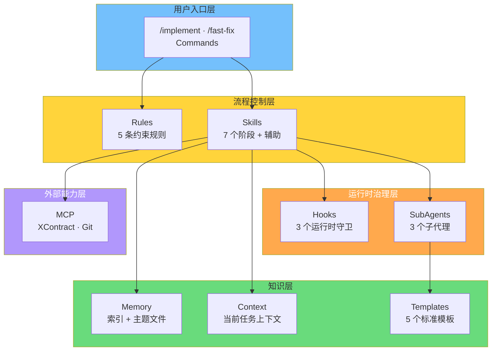
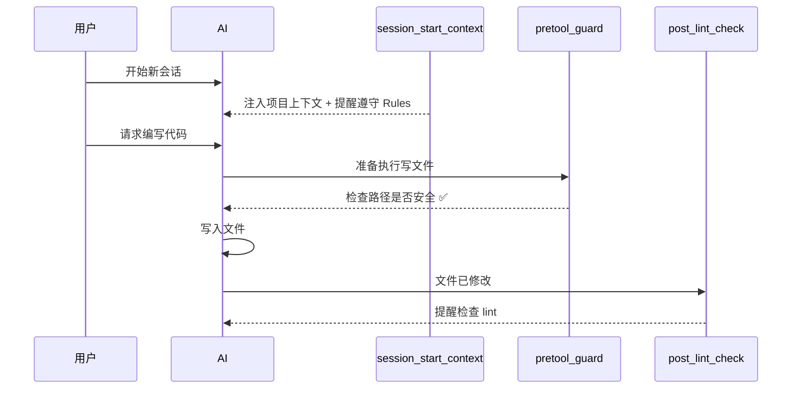

# 第 5 章：体系支撑能力

> **本章核心问题**：Rules / Skills / Hooks / Memory / MCP 各承担什么角色？它们怎么协作？
>
> **读完本章你会知道**：6 层底座的完整架构、每个产物的职责和设计来源、它们之间的协作关系。

---

## 5.1 六层架构总览

全流程设计依赖 6 层底座能力，均基于 CodeBuddy 原生能力实现：



| 层 | 组件 | 面向 | 核心作用 |
|----|------|------|---------|
| **用户入口** | Commands (2) | 用户 | 快捷启动流程 |
| **流程控制** | Rules (5) + Skills (7+) | AI | 约束"怎么干活" + 阶段化执行 |
| **运行时治理** | Hooks (3) + SubAgents (3) | AI 运行时 | 守卫高危操作 + 分工执行 |
| **知识** | Memory + Context + Templates (5) | AI 上下文 | 长期知识 + 任务上下文 + 标准格式 |
| **外部能力** | MCP | 外部系统 | 契约查询/校验/提交 |

---

## 5.2 A 层：Rules — 稳定约束

Rules 是 AI 的"**规范手册**"——告诉 AI"在这个项目里，你该遵守什么规则"。它们在每次会话中自动加载（`alwaysApply: true`），AI 无法跳过。

| Rule | 适用范围 | 核心作用 | 设计来源 |
|------|---------|---------|---------|
| **delivery-workflow** | 所有任务 | 任务分类 + 6 阶段 Skill 链调度 + 验证必须有证据 + 回流机制 + 四分类归档 | 方案全流程设计（4 层来源共同推导） |
| **workspace-architecture** | 整个工作区 | 识别 4 个项目 + 配置键映射表 + 契约对齐优先 + 新旧混淆禁止项 | 自身项目现状 + 信贷 MIS（配置表结构） |
| **xpage-frontend-guardrails** | 新前端 `mmpayproductpermissionhtml` | 路由真相源(`src/index.ts`) + `window.wxpay.router` 强制 + 三层分离 + 禁止自建壳 | XPage 平台约束 + 踩坑经验 |
| **xdc-backend-contract-guardrails** | 新后端 `mmpayxdcproductpermissionweb` | 先改契约再写代码 + Controller 以生成结构为准 + 无 Service 层 + BizError 标准 | XDC 框架约束 + 契约驱动实践 |
| **git-workflow** | 涉及 Git 操作时 | 不直接改 master + 分支命名规范 + Commit 类型 + 禁止 force push | 通用 Git 最佳实践 |

**写法来源**：OpenHarness 的 `CLAUDE.md`——祈使句、精简、可执行。Rules 不写解释文字，只写"做什么"和"不做什么"。

> **设计理由**：为什么用 Rules 而不是在 Skill 里写规范？因为 Rules 是**全局生效**的——无论当前在哪个阶段、执行哪个 Skill，Rules 都自动加载。而 Skill 只在对应阶段生效。平台约束、编码规范这类"任何时候都必须遵守"的东西，放 Rules 里才对。
>
> **溯源**：voucher 团队的推导——"AI 不知道的规范就会反复违反，应该写成 AI 可读的 Rules 文件自动加载"。

---

## 5.3 B 层：Skills — 阶段化执行

Skills 是 AI 的"**操作手册**"——告诉 AI"在这个阶段，你该做什么、怎么做、产出什么"。每个阶段有对应的 Skill，AI 根据当前阶段自动加载。

| Skill | 阶段 | 核心产出 | 关键机制 |
|-------|------|---------|---------|
| **requirement-analysis** | ① 需求分析 | `requirement-analysis.md` | 前提挑战 + 代码库搜证 + 四要素 + 穷举策略 + 就绪度评级 |
| **spec** | ② 规范定义 | `spec.md` | 场景判断（纯前端/纯后端/全栈）+ 5 必选章节 + 禁止 TBD |
| **design** | ③ 方案设计 | `tasks.md` | 澄清分级(P0/P1/P2) + 批次划分 + 每任务含 DoD/回退 |
| **coding** | ④ 编码实现 | 实现代码 | Step 0 契约校验 + 逐批次执行 + 8 条禁止项 |
| **testing** | ⑤ 测试验证 | `test-cases.md` | 四要素推导用例 + 证据要求 + 4 级回流 |
| **archiving** | ⑥ 归档沉淀 | Rules/Memory/模板更新 | delta-first + 四分类 + 人确认才写基线 |
| **ui-guide** | 辅助（按需） | UI 规范参考 | 6 种低代码模板 + TDesign 组件速查 |

**每个阶段都有人工门禁**——AI 产出交付物后 STOP，必须等人确认才能进入下一阶段。

**3 个空目录**（`coding-lite`、`spec-design`、`testing-archiving`）是预留的组合 Skill 占位，可能用于后续流程简化。

> **写法来源**：CodeBuddy 原生 Skills 系统（YAML frontmatter + Markdown 正文）+ OpenHarness 的 Skill 按需加载思路。

---

## 5.4 C 层：Commands — 用户入口

Commands 是用户启动流程的**快捷入口**，不需要记住阶段名称和 Skill 名称。

| 命令 | 作用 | 触发的流程 |
|------|------|----------|
| `/implement [需求描述]` | 启动 Implement 全流程 | 6 阶段 Skill 链 |
| `/fast-fix [问题描述]` | 启动 Fast-fix 模式 | 跳过 ①②③，直接 ④→⑤→⑥ |

> **写法来源**：CodeBuddy Slash Commands 文档（`.codebuddy/commands/*.md`）。结构启发来自 `agent-skills` 的 7 命令设计（`/spec /plan /build /test /review /code-simplify /ship`）。

---

## 5.5 D 层：Hooks — 运行时守卫

Hooks 是 AI 运行时的"**安全网**"——在 AI 执行操作的关键时刻自动触发，拦截危险或提醒检查。

### 三个 Hook 的触发时机



### 详细说明

#### `session_start_context`（会话启动）
- **触发**：每次新会话开始
- **行为**：根据当前路径自动识别项目（新前端/新后端/旧前端/旧后端/通用），注入专属编码提示。如 `current-task.md` 存在，提醒 AI 优先读取。
- **来源**：OpenHarness `claudemd.py`（向上遍历发现 + 注入 system prompt）+ 我们自创的"引导 AI 走流程选择"

#### `pretool_guard`（工具调用前守卫）
- **触发**：AI 每次调用写文件/删文件/执行命令时
- **行为**：
  - **直接阻止**：`rm -rf /`、`mkfs`、`dd if=... of=/dev/`、`shutdown`、fork 炸弹
  - **要求确认**：`git push --force`、`git reset --hard`、`curl|bash`
  - **目录保护**：禁止修改 `.git` 元数据；禁止删除 `.codebuddy` 文件
  - **产物保护**：删除流程产物（`requirement-analysis.md`/`spec.md`/`tasks.md`/`test-cases.md`/`archiving.delta.md`）需人确认
  - **路径边界**：目标不在工作区内需人确认
- **来源**：OpenHarness `hooks/` 子系统（PreToolUse 事件）+ gstack `careful`/`freeze`/`guard` 三级护栏思路

#### `post_lint_check`（文件修改后提醒）
- **触发**：AI 写入/编辑 `.ts`/`.tsx`/`.js`/`.jsx`/`.vue`/`.json` 文件后
- **行为**：注入提示"文件已修改，请检查 lint 结果"
- **来源**：CodeBuddy Hooks 文档 + 方案文档"改完代码后立即检查 lint"约束

> **设计理由**：为什么需要 Hooks 而不只是在 Rules 里写"不要执行危险命令"？因为 Rules 是**建议性**的——AI 看到规则但仍可能违反。Hooks 是**强制性**的——在运行时拦截，AI 无法绕过。这是"约束"和"控制"的区别（对应 Harness Engineering 的两个维度）。

---

## 5.6 SubAgents — 分工执行

SubAgents 是**专注于特定任务的子代理**——它们有明确的职责边界和写入限制，防止"一个 Agent 做所有事"导致上下文污染。

| SubAgent | 所属阶段 | 职责 | 写入边界 |
|----------|---------|------|---------|
| **design-clarifier** | ③ 设计 | 围绕 spec 做代码搜证和风险澄清，产出 P0/P1/P2 分级问题清单 | 仅写 `clarifications.draft.md` |
| **batch-implementer** | ④ 编码 | 锁定当前批次，实现代码+验证+更新状态 | 仅写当前批次代码和 `tasks.md` |
| **archiving-delta-synthesizer** | ⑥ 归档 | 对照基线，生成仅包含变化点的归档草稿 | 仅写 `archiving.delta.md` |

**共同特点**：
- 每个 SubAgent 只能写**指定范围**的文件，禁止写代码/spec/Rules/Memory（各自有明确列表）
- 遇到超出职责范围的问题时**停止并返回**，不自行扩展
- 都引用对应的 Template 来规范输出格式

> **溯源**：SubAgent 上下文隔离参考了 `specmate` 的设计——在设计/编码阶段使用 SubAgent 降低上下文污染。CodeBuddy 原生 Agent 系统提供了 12+ 配置维度（`enabledAutoRun`、`allowed-tools`、写入限制等）。

---

## 5.7 E 层：Memory / Context / Templates — 知识与格式

### Memory 体系

```
MEMORY.md（索引文件）
├── memory/project-architecture.md   → 四项目架构
├── memory/platform-and-framework.md → 平台 API + 框架约定
├── memory/scheme-summary.md         → 方案摘要
├── memory/external-practices.md     → 外部实践结论
└── memory/2026-04-XX.md             → 工作日志
```

- **MEMORY.md** 是索引，指向各主题文件，不堆积详细内容
- 主题文件按领域拆分，读取时按需加载
- 工作日志按日期记录，用于回顾历史决策

> **写法来源**：OpenHarness `memory/manager.py` 的索引 + 主题文件拆分思路。gstack `/learn` 提供了四分类模型（Pattern/Pitfall/Preference/Architecture）。

### Context

- `context/current-task.md` — 当前任务的临时上下文，会话间可续接
- `context/clarifications.draft.md` — 设计澄清草稿（子代理产出）
- `context/archiving.delta.md` — 归档增量草稿（子代理产出）

### Templates（5 个）

| 模板 | 用途 | 使用者 |
|------|------|--------|
| **archiving-delta-template** | 增量归档草稿结构 | `archiving-delta-synthesizer` 子代理 |
| **clarifications-draft-template** | 设计澄清草稿结构 | `design-clarifier` 子代理 |
| **tasks-batch-template** | 批次化任务清单结构 | design Skill + `batch-implementer` |
| **handoff-template** | 跨会话任务交接 | 任务跨会话时使用 |
| **memory-capture-template** | Memory 条目沉淀格式 | 归档阶段 + 任何需记录经验时 |

---

## 5.8 F 层：MCP — 外部能力

| 能力 | 当前状态 | 作用 |
|------|---------|------|
| **XContract MCP** | 可用 | 契约查询（`getInterfaceList`/`getInterfaceDetail`）、语义搜索、校验、创建 MR |
| **工蜂 / Git** | 部分可用 | 代码提交、分支推送 |
| **iWiki / 知识库** | 待接入 | 按需拉取团队知识文档 |

**当前缺口**：
- MCP 无"拉取契约文件到本地"能力 → 首次需插件或手动 git
- `validateProtoContent` 仅支持 proto → OpenAPI(yaml) 校验需本地工具

---

## 5.9 协作全景

以一个 Implement 任务为例，各层组件的协作关系：

```
用户输入 /implement "待处理订单查询"
    │
    ▼
Commands 层：触发 Implement 流程
    │
    ▼
Rules 层：delivery-workflow 判断任务类型 = Implement
         workspace-architecture 识别涉及的项目
    │
    ▼
Skills 层：按顺序加载 6 个阶段 Skill
    │
    ├── ① requirement-analysis Skill 执行
    │     └── 读取 Memory（项目架构、平台知识）
    │     └── 产出 requirement-analysis.md → STOP 等人确认
    │
    ├── ② spec Skill 执行
    │     └── 场景判断 → 生成 spec.md → STOP
    │
    ├── ③ design Skill 执行
    │     └── 调用 SubAgent design-clarifier（搜证 + 澄清）
    │     └── 引用 tasks-batch-template
    │     └── 产出 tasks.md → STOP
    │
    ├── ④ coding Skill 执行
    │     └── Step 0：XContract MCP 校验契约一致性
    │     └── 逐批次调用 SubAgent batch-implementer
    │     └── pretool_guard Hook 守卫每次写入
    │     └── post_lint_check Hook 提醒 lint
    │     └── 每批次 STOP 等人审查
    │
    ├── ⑤ testing Skill 执行
    │     └── 基于四要素推导测试用例
    │     └── 验证失败时做根因分类 → 可能回流
    │     └── STOP 等人验收
    │
    └── ⑥ archiving Skill 执行
          └── 调用 SubAgent archiving-delta-synthesizer
          └── 引用 archiving-delta-template + memory-capture-template
          └── 产出 delta → STOP → 人确认 → 写入基线
```

---

## 本章小结

| 层 | 组件数 | 核心作用 | 设计来源 |
|----|--------|---------|---------|
| Commands | 2 | 用户快捷入口 | CodeBuddy Slash Commands + agent-skills |
| Rules | 5 | 全局约束，自动加载 | OpenHarness 写法 + 自身约束 |
| Skills | 7+3占位 | 阶段化执行，逐步产出 | CodeBuddy Skills + 方案全流程 |
| Hooks | 3 | 运行时守卫，强制拦截 | OpenHarness + gstack 护栏 |
| SubAgents | 3 | 分工执行，上下文隔离 | specmate + CodeBuddy Agent |
| Memory/Templates | 索引+5主题+5模板 | 长期知识 + 标准格式 | OpenHarness 拆分 + gstack 四分类 |
| MCP | 1可用+2待接入 | 外部系统接入 | XDC/XContract 现有能力 |

---

> **下一章**：[第 6 章：产物溯源全表](ch06-provenance.md) — 每个具体产物的设计来源是什么？
