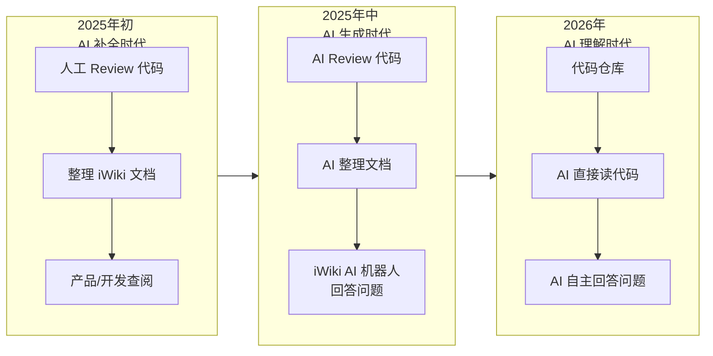
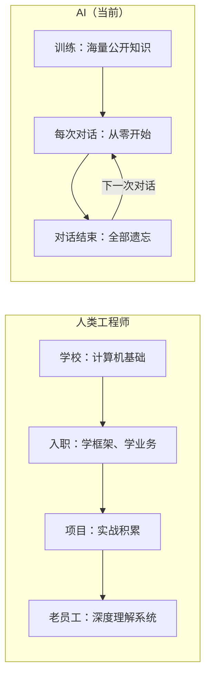
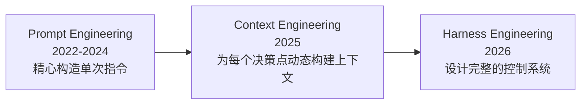
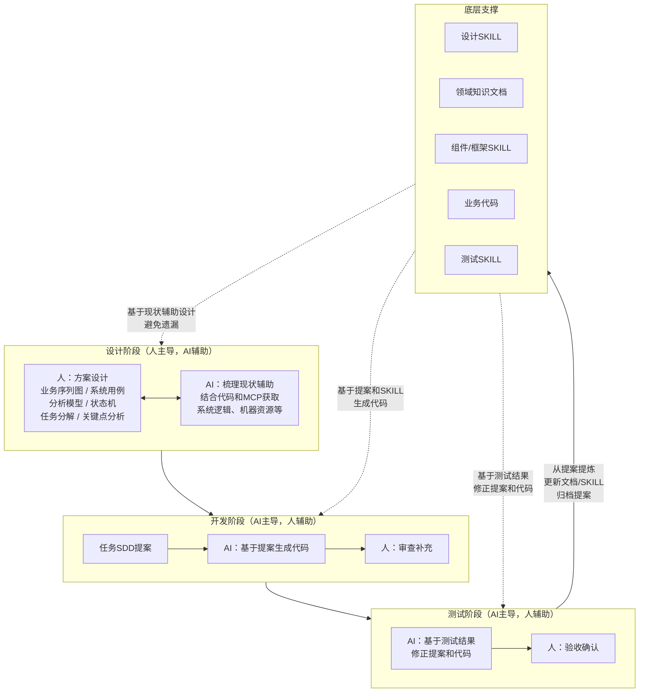
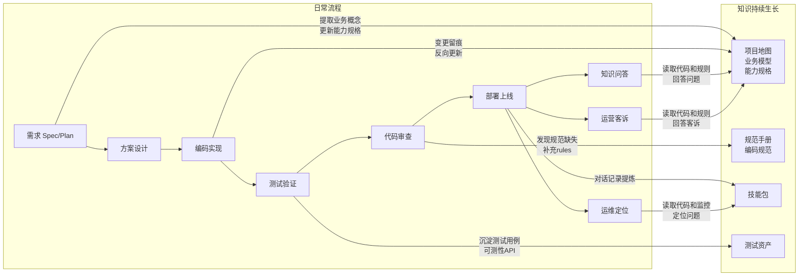
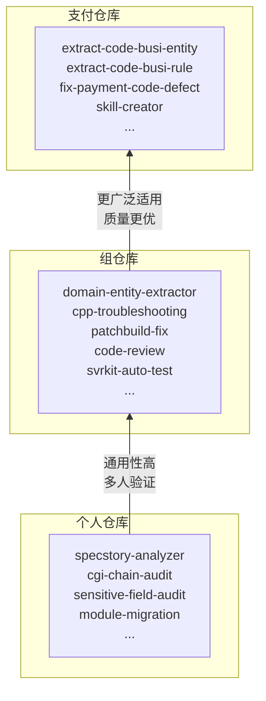

# AI 浪潮下以 Code 为核心的开发模式实践

---

## 一、AI 越来越聪明，但视乎缺少点什么

### AI 在改变我们的工作方式




**2025 年初**，AI IDE 还停留在补全阶段。我们靠人工 Review 代码、整理 iWiki 文档，给产品和开发同学查阅。文档维护成本高，容易过期脱节。

**2025 年中**，AI 模型变聪明了。我们让 AI Review 代码并整理文档，再通过 iWiki 的 AI 机器人回答产品和开发的提问。文档生成效率大幅提升，以前人工做的事情被 AI 替代了。

**2026 年**，AI 更聪明了。我们甚至可以直接告诉 AI 代码仓库在哪，让它自己读代码来回答问题，连文档这个中间层都可以去掉。

AI 越来越聪明，以前的很多工具和方法正在被颠覆

### 但是，直接把 TAPD 贴给 AI？

既然 AI 这么聪明了，我们自然想过：能不能直接把 TAPD 上的需求贴给 AI，让它帮我们完成开发？

**试了。做不好。**

把一个需求描述直接扔给 AI，它能写出看起来像样的代码，但实际上问题百出——用了错误的框架调用方式、漏掉了关键的业务校验、不知道该调哪个内部组件、代码风格也不符合团队规范。

AI 确实越来越聪明了，但面对我们这个 12 年历史的存量系统，"聪明"远远不够。

**为什么？**

---

## 二、问题：为什么 AI 还不够好

### 先理解 AI 的本质

回想一下我们自己的成长路径：在学校学了计算机基础知识，入职后学习各种内部框架、业务背景、组件、规范，然后一个个项目磨练成长，最终成为能独当一面的老员工。

**AI 的本质，是一个计算机基础知识极其扎实的"超级应届生"。** 它学过几乎所有公开的技术知识，算法、设计模式、各种开源框架都信手拈来，可以说比大多数人类毕业生的基础都强。

但它有一个致命的缺陷：**没有长期记忆。**

一个人类新员工，第一天不懂没关系，第二天还记得昨天学了什么，第三天积累更多，逐渐成长为专家。但 AI 不同——**每次对话开始时，前面所有的积累都归零了。** 它就像一个每天都失忆的天才，昨天教过它的东西，今天又全忘了。




- **人类工程师** = 普通学生 + 长期记忆 + 多年项目积累 → 老员工
- **裸奔的 AI** = 天才学生 + 零长期记忆 + 不了解你的系统 → 永远在"入职第一天"

### AI 不知道什么

理解了这个本质，就明白为什么 AI 在我们的 12 年存量系统上经常"干不好活"——它每次都是一个刚来的天才新员工，面对大量它从未见过的隐性知识：


| 层面     | 例子                                         | 为什么 AI 不知道           |
| ------ | ------------------------------------------ | -------------------- |
| **框架** | Svrkit 服务调用模式、XWI、LiteApp                  | 内部框架，通用模型从未见过        |
| **组件** | XConfig 配置管理、IDKey 监控体系、错误码系统，KV，组件的实时运维数据 | 组织内的基础设施，不在公开训练数据中   |
| **业务** | 业务概念、商业运作模式、领域知识                           | 领域特定的业务概念，只存在于我们的系统中 |
| **规范** | 各种内部规范文档                                   | 团队内的共识，人都没完全学会，别说AI了 |


### 核心问题

**AI 模型的通用知识 vs 我们系统 12 年积累的领域特定知识** —— 这是核心矛盾。

换句话说，我们需要一个东西，能让这个"失忆的天才"在每次对话开始时，快速找回关于我们系统的记忆。这个东西应该包含我们系统的技术栈、设计思路、业务背景、业务模型……让 AI 每次都能从"入职第一天"直接跳到"老员工状态"。

这个东西是什么？

---

## 三、在 AI 拥有长期记忆之前

第二章说了，AI 是一个没有长期记忆的天才。在它真正拥有长期记忆之前，**人必须系统化地为 AI 构建记忆**——每次对话都给它提供足够的项目知识，让它从"入职第一天"跳到"老员工状态"。

如果不做系统化指导，会怎样？以下都是我们真实经历过的翻车现场。

### 缺项目地图 + 代码分散

**案例一：全仓搜索连续超时**

让 AI 在代码仓库中查找"谁在往 mmpaymktbankfavormq 发送 MQ 消息"。AI 开始搜索关键词——**连续 5 次 Timed out after 25s**。整个代码目录太大（几百万行代码分散在十几个仓库），AI 的全文搜索直接扛不住。最后不得不手动缩小搜索范围到具体子目录，反复尝试才找到。

> 一个本该 5 分钟搞定的问题，花了大半个小时。

**案例二：代码探索反复超时**

让 AI 理解代金券的一个调用链。为了尽快搞清楚，我们开了 **7-8 个并行的子 Agent 会话**，全部在超时中挣扎。根本原因：这个业务的代码散落在 `mmtenpay`、`mmpaygateway`、`mmpay_git` 三个不同的仓库中，AI 没有一个完整的视角。

> 如果代码都在一个仓库里，AI 一次搜索就能串起整个链路。

**→ 推导：需要项目地图和单仓一体化。** AI 需要知道系统的整体结构——有哪些模块、各自负责什么、相互怎么调用。而且一个业务的所有代码应该聚合在一个仓库里，AI 才能一次性看到完整上下文。

### 缺结构化知识管理

**案例三：找错方向 + 文档脱节**

给 AI 一个 TAPD 需求链接，让它出"智能投放单笔立减金"的开发方案。AI 先是拉 TAPD 超时，然后在本地找方案文档——**结果读了一份"银行提现免费券"的方案**，跟需求完全不搭。我不得不纠正它："你是不是找错地方了？是多笔立减的需求，跟银行提现免费券没关系。"

> 需求在 TAPD、设计在 XWATT、代码在 GIT 仓库——AI 分不清哪个对应哪个。

**→ 推导：需要结构化的知识管理。** 需求文档、设计文档、代码应该在同一个仓库里，通过清晰的目录结构组织，AI 才能根据上下文直接定位到正确的信息。

### 缺规范手册

**案例四：同类规范问题反复出现**

AI 用 `%lu` 打印 `wxuin_t` 类型——不符合我们的编码规范，应该用 `static_cast<uint64_t>()` + `PRIu64`。代码风格问题、空指针未校验、格式不一致……这些都不是 AI 能力不行，而是**它不知道我们团队的规范**。每次 Review 都要人指出同样的问题。

> AI 不知道的规范，就会反复违反。

**→ 推导：需要规范手册。** 编码规范、框架约定、架构约束应该写成 AI 可读的 Rules 文件，放在代码仓库里。AI 每次开始工作时自动加载，而不是靠人在 Review 里反复纠正。

### 缺技能包

**案例五：编译修复没有章法**

让 AI 修复一个模块的编译问题。它逐个文件地改——改完一个编译，又报下一个错，再改再编译……15 个文件有同样的错误，它一个一个改。AI 自己都说：**"逐一修复太慢了，让我一次性检查所有依赖路径的存在性。"** 但为时已晚，已经浪费了大量编译等待时间。

另一次做跨主体接口排查，先是写脚本、再手动分析、再换方案……走了冗长弯路后，才最终收敛成一个可复用的 Skill。

> 没有操作指南时，AI 每次都要从零摸索同样的路。

**→ 推导：需要技能包。** 把"老员工的手艺"——怎么修编译问题、怎么做安全排查、怎么做代码审查——变成 AI 可执行的 Skill，AI 下次遇到同类问题直接按章法来。

### 缺测试资产

**案例六：边界遗漏反复发生**

让 AI 搜索 proto 文件中的 `mch_code` 字段。AI 写了正则表达式只匹配 `optional/required/repeated` 前缀——但 proto3 语法没有这些前缀，**导致漏掉了大量字段**。AI 事后承认"可能漏掉很多"，不得不重新调整策略。

类似的遗漏在其他场景中也反复出现：AI 不了解系统的边界条件，生成的代码缺少防御性校验。

> 没有测试用例告诉 AI "什么情况该通过、什么情况该拒绝"，AI 就会在边界上反复踩坑。

**→ 推导：需要测试资产，而且它本身就是反馈循环。** 测试用例定义了系统的边界。AI 犯错 → 补充测试用例 → AI 下次能看到这些约束 → 生成更健壮的代码 → 新的边界问题 → 继续补充。这是一个不断强化的循环。

### 汇总：我们需要什么

从这些翻车现场中，可以清晰地推导出——**在 AI 拥有长期记忆之前，我们需要为每个项目构建一套结构化的知识体系**：

```
项目的结构化知识体系
│
├── 项目地图：系统结构、模块职责、技术栈
├── 业务全景：领域概念、业务模型、核心流程
├── 规范手册：编码规范、框架约定、架构约束
├── 技能包：可复用的操作指南（编译修复、代码审查、安全排查……）
├── 测试资产：测试用例、可测性 API、边界约束
└── 单仓一体化：代码 + 上述所有知识，放在同一个仓库
```

这就好比仙侠世界的**"内丹"**——一个项目的精华，让 AI 每次对话时能快速恢复主要记忆

内丹怎么运作？三个关键点：

- **代码是唯一的真相源。** 设计文档会过期，Wiki 会腐烂，但代码永远反映当前行为。所有结构化知识都应该从代码中提炼、与代码同仓管理——传统模式是"代码 + 散落各处的文档 → 人读"，新模式是"代码 + 与代码同仓的结构化知识 → AI 读 + 人读"。
- **每次迭代，代码和知识同步更新。** 内丹不是一次性产物，而是跟着每次需求迭代一起生长。
- **单仓一体化。** 一个项目的所有产出物——后端服务、前端页面、小程序、LiteApp、需求文档、设计文档、测试用例、开发规范——都放在同一个仓库。AI 一次性获取完整上下文，前后端全栈理解。

---

## 四、行业共识：我们不是在闭门造车

在展开具体的一些实践之前，先看看行业在发生什么。

### Harness Engineering：2026 年 AI 工程圈最热的话题

同一个模型，换一套 Harness（模型外面包裹的那层"壳"），编程基准成功率从 **42% 跳到 78%**。模型没换，数据没换，提示词也没换——**Harness 带来的提升，相当于换了一代模型。**




> Prompt Engineering 是教你怎么写一封好邮件；Context Engineering 是教你怎么把相关附件都带上；Harness Engineering 是教你怎么搭建整个办公室，让员工（Agent）能持续、稳定、高质量地工作。

### 头部团队怎么做的

- **OpenAI Codex 团队**：5 个月，100 万行代码，1500 个 PR，全部由 Agent 生成，人类零行手写。核心工程师总结：**"Agent 不难，Harness 才难。"**
- **Stripe**：每周 1300 个 PR，全部由无人值守 Agent 完成。结论：**"成功取决于可靠的开发者环境、测试基础设施和反馈循环，跟模型选择关系不大。"**
- **Cursor**：建立了良好的工程体系，每小时 1000 个 commit，一周超过 1000 万次工具调用

### 仓库是 Agent 唯一的知识来源

OpenAI 团队的核心理念：

> 代码、markdown、schema、可执行计划，全都版本化地存在仓库里。没有外部 wiki，没有 Notion 文档，没有"口口相传"的潜规则。Agent 看不到仓库之外的东西，所以仓库必须包含 Agent 工作所需的一切。

**这和我们的"单仓一体化"理念完全一致。**

### 护栏悖论

**车速越快，护栏越重要。** 模型越强，越需要精心设计的约束系统确保它跑在正确的方向上。

> Mitchell Hashimoto（HashiCorp / Terraform 创始人）定义 Harness Engineering：**每当你发现 Agent 犯了一个错误，你就花时间去工程化一个解决方案，让它再也不会犯同样的错。**

---

## 五、我们的实践

构建知识体系不是一个项目，而是一个持续的过程。它融入到研发、运营、运维的每一个环节中，每做一件事，知识就厚一分。

### AI 参与设计开发测试的工作流

过去是人设计、人开发、人测试。现在的核心转变是：**人主导设计，AI 辅助梳理现状；AI 主导开发和测试，人辅助审查补充。**




#### 设计阶段：人主导，AI 辅助梳理现状

方案设计仍然由人主导——架构决策、业务判断、关键取舍这些事情目前还是人来做。但 AI 已经参与其中：

- **AI 辅助梳理现状**：结合代码和 MCP 工具获取系统各种现状（业务逻辑、机器资源、外部依赖、组件运维等），帮助人在设计时避免修改点遗漏
- **设计输出物**：业务序列图、系统用例、分析模型、状态机图、分析序列图、设计序列图、任务分解、关键点分析、协议定义、XMODEL 模型等

设计完成后，最关键的一步是**生成 SDD 提案**——这是从设计到 AI 开发实现的桥梁：

- **AI 主导生成，人补充完善**
- 基于任务分解拆分为多个提案，每个提案结合设计内容、领域知识文档、组件/框架 SKILL 和代码现状
- 提案不是给人看的"需求文档"，而是给 AI 看的"结构化上下文"

#### 开发阶段：从设计提案到高质量代码的精准转化

开发阶段的核心创新是引入**任务 SDD 提案**作为 AI 生成代码的结构化上下文。

提案包含的关键要素：


| 要素              | 作用                                   |
| --------------- | ------------------------------------ |
| **具体流程逻辑**      | 业务执行的完整步骤描述，确保 AI 理解业务执行的先后顺序与条件分支   |
| **领域逻辑**        | 领域模型的约束与规则，保证生成的代码符合业务领域的内在逻辑的领域知识文档 |
| **组件使用方式和最佳实践** | 指定使用哪些框架组件及其标准用法，避免 AI 自由发挥引入不一致的技术栈 |
| **规范**          | 命名约定、目录结构、注释规范等，确保生成的代码与团队现有代码风格一致   |


**代码生成公式：**

```
任务 SDD 提案 × 组件/框架 SKILL × 领域知识文档 × 规范 → 高质量业务代码
```

这种方式将 AI 生成代码的质量从"随机涌现"提升为**"可控、可预期的标准输出"**，大幅减少人工修改与审查成本。

#### 领域知识文档提炼什么

领域知识文档不是什么都写，而是聚焦于四类内容：

```
领域知识文档提炼原则
│
├── 系统核心知识：领域实体、协议对象、架构图、业务规则、质量规则
├── 隐性知识：业务概念、组织内约定的知识、历史坑点、特殊逻辑、架构约束
└── 代码第一性原则：能通过代码和MCP获取到的就尽量不写或者只给方法和索引
```

**领域实体**的知识结构：

- **领域字段**：基于 XMODEL 生成 PO 的索引。全新开发内聚实现，索引代码文件路径；历史代码散落各处，标明逻辑和可复用代码位置
- **领域逻辑**：基于领域字段的读判断逻辑
- **领域操作**：基于领域字段的写逻辑
- **历史坑点 / 特殊逻辑**：踩过的坑和特殊处理

**协议对象**的知识结构：

- **字段**：基于 proto 的索引
- **领域逻辑**：基于字段的读判断逻辑
- **历史坑点 / 特殊逻辑**

> 流程逻辑不写进知识文档——通过 xcontract 实时扫描模块接口功能，实时读取对应接口的最新逻辑，保证代码第一准确性。

#### 测试阶段：AI 主导测试，人辅助验收

测试阶段同样是 AI 主导、人辅助。整体分三步走：

**第一步：AI 生成测试文档**

基于需求文档、设计文档、代码变更和历史手工测试数据，AI 生成结构化的测试用例文档。每个测试用例包含三部分：


| 组成部分     | 内容                                  |
| -------- | ----------------------------------- |
| **前置条件** | 测试数据（商户号、uin）、环境构造流程（创建批次、激活、开启发放等） |
| **测试流程** | 需要调用哪些接口、按什么顺序执行                    |
| **后置断言** | 预期行为（优惠成功批出、支付成功等）                  |


对于复杂接口（如批价、锁券、实扣），直接提供历史手工测试数据作为参考示例，避免大量 token 浪费在调试参数上。

**第二步：AI 编写测试脚本，直接运行调试**

测试文档审查后，AI 将用例编写为可执行的 Python 测试脚本，直接运行调试。遇到问题时，AI 结合报错信息自动修复——以"单品单件优惠批价并支付成功"为例，AI 自动修复了三个问题：收银台发放参数错误、批次开始时间错误导致优惠未批出、实扣参数错误。人辅助处理 AI 解决不了的环境和配置问题。

**第三步：第一个用例通过后，迭代扩展**

第一个用例跑通后，沉淀可复用的库函数和调用经验（如创建批次的参数、批价的参数）。AI 继续生成其他测试用例的文档，再编写脚本执行——后续同类用例基本一次通过。在"单品单件代金券"用例全部验证通过后，再迭代到"普通单品代金券"用例，借助已有脚本和库函数快速通过。

**单元测试、接口测试、UI 测试：同一流程，复杂度递增**

上述以接口测试为例，单元测试和 UI 测试的整体流程差别不大：

- **单元测试**：最简单，不依赖外部接口，从代码逻辑分支驱动
- **接口测试**：中等复杂度，需要调用外部接口和构造测试数据
- **UI 测试**：最复杂，测试流程和断言中增加了 UI 操作，需要额外积累 UI 操作知识（操作路径、页面关键字）

**测试的飞轮效应**

- 已有测试文档帮 AI 理解业务流程，不同用例往往只是个别条件不同 → 生成质量和速度持续提升
- 自动化测试反向推动**可测试性建设**（清理券、清理用户限领、创建批次等可测试 API），这些 API 可复用于多个需求的测试和产品验收
- 回归验证、页面操作的时间 → 转投自动化测试沉淀 → 覆盖度和效率持续增长

#### 闭环：从提案提炼，进化知识和 SKILL

每次需求做完后，不是做完就完了，还有关键的一步——**从提案中提炼，更新领域知识文档和 SKILL，归档提案**：

- 提案中沉淀的业务规则、架构决策 → 更新领域知识文档
- 提案中发现的可复用模式 → 进化为新的 SKILL
- 过时的中间知识 → 淘汰清理
- 完成的提案 → 归档留痕

这就形成了**设计 → 开发 → 测试 → 提炼 → 下一次设计**的完整闭环，每转一圈，知识体系就厚一层。

### 全流程中的实践




**1. 大仓迁小仓：按子域聚合代码和文档**

第三章的反面案例已经说明了代码分散带来的痛苦。我们正在做的一件大事就是**大仓拆小仓——把散落在 mmtenpay 大仓里的模块，按业务子域迁移到独立的小仓**（如 `mmpay_git/mmpay_wxpay/voucher`）。

这不只是一次代码搬迁，而是**为项目打地基**：

- 迁移前：一个业务的代码散落在大仓的各个角落，AI 搜索超时、依赖路径混乱、include 指向旧位置
- 迁移后：一个业务子域的所有代码聚合在一个仓库里，AI 能一次性看到完整上下文

**2. 每次需求迭代：SDD 沉淀知识和SKILL**

每次接到需求，需求分析 → 方案设计 → 任务拆解 → 编码 → 变更留痕。每个环节都在丰富项目知识——需求分析阶段提取业务概念，设计阶段沉淀架构决策，实现与设计不一致时在 `modify.md` 留痕并反向更新。一个需求做完，代码更新了，知识也同步更新了。

**3. 每次测试：沉淀测试资产**

- **单元测试**：随代码一起写入仓库，AI 下次改这块代码时能看到测试约束
- **接口测试 / 可测性 API**：通过 Skill 从契约自动生成测试脚本，沉淀到仓库中
- **Part-UAT 自动化测试**：UI 自动化测试用例也纳入仓库管理

每一轮测试，都在让 AI 更清楚"这个系统的边界在哪，什么情况该通过，什么情况该拒绝"。

**4. 每天的对话记录：Skill 飞轮**

每个人每天和 AI 的对话记录是一座金矿。我们定期对增量对话数据让 AI 分析提取，识别可复用的操作模式，形成结构化的 Skill。Skill 不是人凭空写的手册，而是从真实的人机协作实践中自然生长出来的。

个人仓里有个 `specstory-analyzer`——专门分析对话记录，自动提取可复用 Skill。**Skill 在生产 Skill，这是一个自举的飞轮。**

**5. 每次代码审查：补充规范**

AI 生成的代码在 Review 中被发现不符合团队习惯？把这条规范写进 `rules`。下次 AI 就不会再犯同样的错。

**6. 每次 SOA 治理：积累工程 Skill**

编译报错修了一种新类型？沉淀成 `patchbuild-fix` Skill。XSOA 修复发现一类新风险？沉淀成 `repair-soa-risk` Skill。这些都是从实战中长出来的。

**7. 知识问答：Knot Agent 让 AI 读代码回答问题**

过去开发同学和产品同学有问题，要么翻 Wiki、要么找人问。现在我们搭建了 **Knot Agent**——它直接读取项目代码仓库和结构化规则，回答开发和产品的问题。

- 产品问"代金券的核销流程是怎样的？"——Knot Agent 读代码和业务文档，给出准确回答
- 开发问"这个接口的调用链路是什么？"——Knot Agent 顺着代码追溯，而不是去翻过期的 Wiki

这是知识体系的**消费端**：问答过程中暴露的知识盲区，反过来驱动我们补充结构化知识。

**8. 运营客诉处理：AgentFlow 自动化排查**

代金券业务有一类高频客诉——"券不能核销"。过去运营反馈到开发，开发手动查日志、查配置、查状态，一个 case 可能花几十分钟。现在我们用 **AgentFlow** 搭建了自动化排查流程：运营输入客诉信息，Agent 自动串联多个系统查询券状态、核销条件、商户配置，给出"为什么不能核销"的结论和处理建议。

**9. 运维问题定位：AI + 多维监控快速定位**

线上告警或异常时，利用 AI 结合多维监控数据和代码，快速定位问题根因。AI 读监控指标发现异常模式，再到代码中追溯对应的逻辑路径，比人工翻日志、翻代码高效得多。每次排查沉淀的经验，又变成新的排查 Skill，下次同类问题直接按章法来。

### Skill 的多级管理与晋级




- **个人仓**（`cavan_skills/`）：门槛最低，鼓励多提炼。从自己的对话中长出来。
- **组仓**（`mkt_skills/ ,` 20+ 个）：组内多人验证有效后晋级。按业务/组件/工程/SOA修复分类管理。
- **支付仓**（`wxpay_skills/`，30+ 个）：通用性最高的才能晋级到支付线级别。

每个人都是 Skill 的生产者，逐层筛选保证质量，个人经验最终变成组织资产。

### 本质：反馈循环

上面这些实践，本质上都是**反馈循环**——AI 做事 → 发现问题 → 改进知识/Skill/测试 → AI 下次做得更好：

- **Skill 体系是反馈循环**：AI 犯错 → 从对话中提炼 Skill → AI 下次不再犯 → 新的错误出现 → 继续提炼
- **测试沉淀是反馈循环**：AI 生成代码 → 测试发现边界问题 → 补充测试用例 → AI 下次能看到这些约束 → 生成更健壮的代码
- **Rules 积累是反馈循环**：AI 违反团队规范 → Review 发现 → 写入 rules → AI 下次自动遵守
- **SDD 迭代是反馈循环**：AI 基于项目知识做需求 → 实现中发现偏差 → modify.md 留痕反向更新 → 知识更准确

每一个反馈循环都在让知识体系变厚、变准、变强。它们叠加在一起，形成一个**相互增强的飞轮**：

- 知识越完善 → AI 做需求越准确 → 产出质量越高 → 知识进一步完善
- Skill 越丰富 → AI 能做的事越多 → 对话中的模式越多 → 提炼出更多 Skill
- 测试资产越厚 → AI 对边界理解越深 → 代码越健壮 → 测试资产继续积累

**AI 基于这些反馈循环，就能从天才毕业生进化为天才工程师**

---

## 六、总结

### 我们在做的，类似 Harness Engineering


| 我们的实践                      | Harness 概念 | 一句话                             |
| -------------------------- | ---------- | ------------------------------- |
| 结构化知识（项目地图 / 业务全景 / 领域知识）  | 上下文工程      | 让 AI 看到正确的知识                    |
| Rules + 架构约束               | 确定性约束      | 让 AI 少犯错                        |
| Skill 体系（对话提炼 → 三级晋级）      | 反馈循环       | AI 犯错 → 提炼 Skill → 不再犯          |
| 测试沉淀（单测 / 接口测试 / Part-UAT） | 反馈循环       | AI 生成代码 → 测试发现问题 → 沉淀用例 → 代码更健壮 |
| 反馈循环出错，反哺回知识文档/Skill/Rules | 熵管理        | 对抗信息爆炸，AI漂移                     |
| 单仓一体化（前后端 + 全生命周期文档）       | 仓库即大脑      | 让 AI 看到全貌                       |


### 当下与未来

这可能是当前阶段的较优解

随着模型能力进化，我们所做这些可能越来越薄，直到有一天自然语言就能直接生成可上线系统。但正如 Harness Engineering 的理念："Harness 要轻，要模块化，要随时准备被拆掉重来"

在那一天到来之前——

**这些操作都还是必要的。**

---

*参考资料：[《模型不是关键，Harness 才是》](https://mp.weixin.qq.com/s/sVGeofV9uTgvhgR44q8pNA) - AGI Hunt*